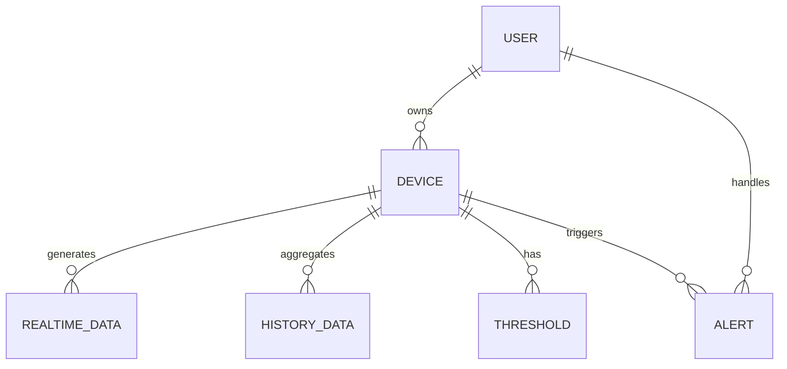
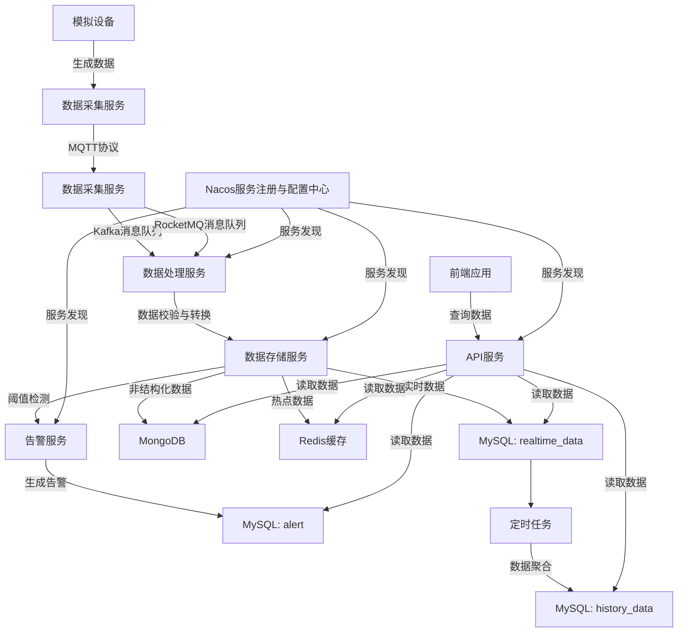

# 能源监测平台数据库设计与数据采集方案

## 1. 数据库设计

### 1.1 数据库选型

| 数据库类型 | 版本 | 选型理由 |
|------------|------|----------|
| MySQL | 8.0 | 关系型数据库，适合结构化数据存储，生态成熟，社区活跃 |
| MongoDB | 6.0+ | 非关系型数据库，适合存储非结构化数据，灵活可扩展 |

### 1.2 表结构设计

#### 核心表结构

#### 1.2.1 用户表（user）
| 字段名 | 数据类型 | 约束 | 描述 | 索引 |
|--------|----------|------|------|------|
| id | BIGINT | PRIMARY KEY, AUTO_INCREMENT | 用户ID | PRIMARY |
| username | VARCHAR(50) | UNIQUE, NOT NULL | 用户名 | UNIQUE |
| password | VARCHAR(100) | NOT NULL | 密码（BCrypt加密存储） | - |
| name | VARCHAR(50) | NOT NULL | 姓名 | - |
| email | VARCHAR(100) | UNIQUE | 邮箱 | UNIQUE |
| phone | VARCHAR(20) | UNIQUE | 手机号 | UNIQUE |
| create_time | DATETIME | NOT NULL, DEFAULT CURRENT_TIMESTAMP | 创建时间 | - |
| update_time | DATETIME | NOT NULL, DEFAULT CURRENT_TIMESTAMP ON UPDATE CURRENT_TIMESTAMP | 更新时间 | - |

#### 1.2.2 角色表（role）
| 字段名 | 数据类型 | 约束 | 描述 | 索引 |
|--------|----------|------|------|------|
| id | BIGINT | PRIMARY KEY, AUTO_INCREMENT | 角色ID | PRIMARY |
| role_name | VARCHAR(50) | UNIQUE, NOT NULL | 角色名称 | UNIQUE |
| description | VARCHAR(200) | NULL | 角色描述 | - |
| create_time | DATETIME | NOT NULL, DEFAULT CURRENT_TIMESTAMP | 创建时间 | - |
| update_time | DATETIME | NOT NULL, DEFAULT CURRENT_TIMESTAMP ON UPDATE CURRENT_TIMESTAMP | 更新时间 | - |

#### 1.2.3 权限表（permission）
| 字段名 | 数据类型 | 约束 | 描述 | 索引 |
|--------|----------|------|------|------|
| id | BIGINT | PRIMARY KEY, AUTO_INCREMENT | 权限ID | PRIMARY |
| permission_name | VARCHAR(50) | UNIQUE, NOT NULL | 权限名称 | UNIQUE |
| permission_code | VARCHAR(50) | UNIQUE, NOT NULL | 权限编码 | UNIQUE |
| description | VARCHAR(200) | NULL | 权限描述 | - |
| create_time | DATETIME | NOT NULL, DEFAULT CURRENT_TIMESTAMP | 创建时间 | - |
| update_time | DATETIME | NOT NULL, DEFAULT CURRENT_TIMESTAMP ON UPDATE CURRENT_TIMESTAMP | 更新时间 | - |

#### 1.2.4 用户角色关系表（user_role）
| 字段名 | 数据类型 | 约束 | 描述 | 索引 |
|--------|----------|------|------|------|
| id | BIGINT | PRIMARY KEY, AUTO_INCREMENT | ID | PRIMARY |
| user_id | BIGINT | NOT NULL, FOREIGN KEY (user_id) REFERENCES user(id) | 用户ID | INDEX |
| role_id | BIGINT | NOT NULL, FOREIGN KEY (role_id) REFERENCES role(id) | 角色ID | INDEX |
| create_time | DATETIME | NOT NULL, DEFAULT CURRENT_TIMESTAMP | 创建时间 | - |

#### 1.2.5 角色权限关系表（role_permission）
| 字段名 | 数据类型 | 约束 | 描述 | 索引 |
|--------|----------|------|------|------|
| id | BIGINT | PRIMARY KEY, AUTO_INCREMENT | ID | PRIMARY |
| role_id | BIGINT | NOT NULL, FOREIGN KEY (role_id) REFERENCES role(id) | 角色ID | INDEX |
| permission_id | BIGINT | NOT NULL, FOREIGN KEY (permission_id) REFERENCES permission(id) | 权限ID | INDEX |
| create_time | DATETIME | NOT NULL, DEFAULT CURRENT_TIMESTAMP | 创建时间 | - |

#### 1.2.6 设备表（device）
| 字段名 | 数据类型 | 约束 | 描述 | 索引 |
|--------|----------|------|------|------|
| id | BIGINT | PRIMARY KEY, AUTO_INCREMENT | 设备ID | PRIMARY |
| device_code | VARCHAR(50) | UNIQUE, NOT NULL | 设备编码 | UNIQUE |
| device_name | VARCHAR(100) | NOT NULL | 设备名称 | - |
| device_type | VARCHAR(50) | NOT NULL | 设备类型（electricity/gas/water） | INDEX |
| location | VARCHAR(100) | NOT NULL | 安装位置 | - |
| status | INT | NOT NULL, DEFAULT 0 | 状态（0-离线，1-在线） | INDEX |
| user_id | BIGINT | NOT NULL, FOREIGN KEY (user_id) REFERENCES user(id) | 所属用户ID | INDEX |
| create_time | DATETIME | NOT NULL, DEFAULT CURRENT_TIMESTAMP | 创建时间 | - |
| update_time | DATETIME | NOT NULL, DEFAULT CURRENT_TIMESTAMP ON UPDATE CURRENT_TIMESTAMP | 更新时间 | - |

#### 1.2.3 实时数据表（realtime_data）
| 字段名 | 数据类型 | 约束 | 描述 | 索引 |
|--------|----------|------|------|------|
| id | BIGINT | PRIMARY KEY, AUTO_INCREMENT | 数据ID | PRIMARY |
| device_id | BIGINT | NOT NULL, FOREIGN KEY (device_id) REFERENCES device(id) | 设备ID | INDEX |
| voltage | DOUBLE | NULL | 电压（V） | - |
| current | DOUBLE | NULL | 电流（A） | - |
| power | DOUBLE | NULL | 功率（W） | - |
| energy | DOUBLE | NULL | 用电量（kWh） | - |
| flow_rate | DOUBLE | NULL | 流量（L/min） | - |
| flow_total | DOUBLE | NULL | 总流量（L） | - |
| pressure | DOUBLE | NULL | 压力（MPa） | - |
| water_level | DOUBLE | NULL | 水位（cm） | - |
| ph_value | DOUBLE | NULL | pH值 | - |
| turbidity | DOUBLE | NULL | 浊度（NTU） | - |
| collect_time | DATETIME | NOT NULL, DEFAULT CURRENT_TIMESTAMP | 采集时间 | INDEX |

#### 1.2.4 历史数据表（history_data）
| 字段名 | 数据类型 | 约束 | 描述 | 索引 |
|--------|----------|------|------|------|
| id | BIGINT | PRIMARY KEY, AUTO_INCREMENT | 数据ID | PRIMARY |
| device_id | BIGINT | NOT NULL, FOREIGN KEY (device_id) REFERENCES device(id) | 设备ID | INDEX |
| data_type | VARCHAR(20) | NOT NULL | 数据类型（hour/day/month） | INDEX |
| start_time | DATETIME | NOT NULL | 开始时间 | INDEX |
| end_time | DATETIME | NOT NULL | 结束时间 | - |
| voltage_avg | DOUBLE | NULL | 平均电压 | - |
| voltage_max | DOUBLE | NULL | 最大电压 | - |
| voltage_min | DOUBLE | NULL | 最小电压 | - |
| current_avg | DOUBLE | NULL | 平均电流 | - |
| current_max | DOUBLE | NULL | 最大电流 | - |
| current_min | DOUBLE | NULL | 最小电流 | - |
| power_avg | DOUBLE | NULL | 平均功率 | - |
| power_max | DOUBLE | NULL | 最大功率 | - |
| power_min | DOUBLE | NULL | 最小功率 | - |
| energy_total | DOUBLE | NULL | 总用电量（kWh） | - |
| flow_rate_avg | DOUBLE | NULL | 平均流量（L/min） | - |
| flow_rate_max | DOUBLE | NULL | 最大流量（L/min） | - |
| flow_rate_min | DOUBLE | NULL | 最小流量（L/min） | - |
| flow_total | DOUBLE | NULL | 总流量（L） | - |
| pressure_avg | DOUBLE | NULL | 平均压力（MPa） | - |
| pressure_max | DOUBLE | NULL | 最大压力（MPa） | - |
| pressure_min | DOUBLE | NULL | 最小压力（MPa） | - |
| water_level_avg | DOUBLE | NULL | 平均水位（cm） | - |
| water_level_max | DOUBLE | NULL | 最高水位（cm） | - |
| water_level_min | DOUBLE | NULL | 最低水位（cm） | - |
| ph_value_avg | DOUBLE | NULL | 平均pH值 | - |
| ph_value_max | DOUBLE | NULL | 最大pH值 | - |
| ph_value_min | DOUBLE | NULL | 最小pH值 | - |
| turbidity_avg | DOUBLE | NULL | 平均浊度（NTU） | - |
| turbidity_max | DOUBLE | NULL | 最大浊度（NTU） | - |
| turbidity_min | DOUBLE | NULL | 最小浊度（NTU） | - |

#### 1.2.5 阈值设置表（threshold）
| 字段名 | 数据类型 | 约束 | 描述 | 索引 |
|--------|----------|------|------|------|
| id | BIGINT | PRIMARY KEY, AUTO_INCREMENT | 阈值ID | PRIMARY |
| device_id | BIGINT | NOT NULL, FOREIGN KEY (device_id) REFERENCES device(id) | 设备ID | INDEX |
| param_name | VARCHAR(50) | NOT NULL | 参数名称（voltage/current/power/energy/flow_rate/pressure/water_level/ph_value/turbidity） | - |
| threshold_value | DOUBLE | NOT NULL | 阈值 | - |
| alert_type | VARCHAR(20) | NOT NULL | 告警类型（upper/lower） | - |
| is_enabled | BOOLEAN | NOT NULL, DEFAULT TRUE | 是否启用 | - |
| create_time | DATETIME | NOT NULL, DEFAULT CURRENT_TIMESTAMP | 创建时间 | - |
| update_time | DATETIME | NOT NULL, DEFAULT CURRENT_TIMESTAMP ON UPDATE CURRENT_TIMESTAMP | 更新时间 | - |

#### 1.2.6 告警表（alert）
| 字段名 | 数据类型 | 约束 | 描述 | 索引 |
|--------|----------|------|------|------|
| id | BIGINT | PRIMARY KEY, AUTO_INCREMENT | 告警ID | PRIMARY |
| device_id | BIGINT | NOT NULL, FOREIGN KEY (device_id) REFERENCES device(id) | 设备ID | INDEX |
| alert_type | VARCHAR(50) | NOT NULL | 告警类型（threshold/exceed/device_offline） | INDEX |
| alert_message | VARCHAR(200) | NOT NULL | 告警信息 | - |
| alert_time | DATETIME | NOT NULL, DEFAULT CURRENT_TIMESTAMP | 告警时间 | INDEX |
| status | INT | NOT NULL, DEFAULT 0 | 状态（0-未处理，1-已处理） | INDEX |
| handle_time | DATETIME | NULL | 处理时间 | - |
| handler | BIGINT | NULL, FOREIGN KEY (handler) REFERENCES user(id) | 处理人ID | - |

#### 1.2.12 系统配置表（system_config）
| 字段名 | 数据类型 | 约束 | 描述 | 索引 |
|--------|----------|------|------|------|
| id | BIGINT | PRIMARY KEY, AUTO_INCREMENT | 配置ID | PRIMARY |
| config_key | VARCHAR(50) | UNIQUE, NOT NULL | 配置键 | UNIQUE |
| config_value | VARCHAR(255) | NOT NULL | 配置值 | - |
| config_desc | VARCHAR(200) | NULL | 配置描述 | - |
| create_time | DATETIME | NOT NULL, DEFAULT CURRENT_TIMESTAMP | 创建时间 | - |
| update_time | DATETIME | NOT NULL, DEFAULT CURRENT_TIMESTAMP ON UPDATE CURRENT_TIMESTAMP | 更新时间 | - |

#### 1.2.13 操作日志表（operation_log）
| 字段名 | 数据类型 | 约束 | 描述 | 索引 |
|--------|----------|------|------|------|
| id | BIGINT | PRIMARY KEY, AUTO_INCREMENT | 日志ID | PRIMARY |
| user_id | BIGINT | NOT NULL, FOREIGN KEY (user_id) REFERENCES user(id) | 用户ID | INDEX |
| operation_type | VARCHAR(50) | NOT NULL | 操作类型 | - |
| operation_desc | VARCHAR(200) | NOT NULL | 操作描述 | - |
| operation_time | DATETIME | NOT NULL, DEFAULT CURRENT_TIMESTAMP | 操作时间 | INDEX |
| ip_address | VARCHAR(50) | NULL | IP地址 | - |

#### 新增表结构（支持新功能）

#### 1.2.14 费用表（fee）
| 字段名 | 数据类型 | 约束 | 描述 | 索引 |
|--------|----------|------|------|------|
| id | BIGINT | PRIMARY KEY, AUTO_INCREMENT | 费用ID | PRIMARY |
| user_id | BIGINT | NOT NULL, FOREIGN KEY (user_id) REFERENCES user(id) | 用户ID | INDEX |
| fee_type | VARCHAR(50) | NOT NULL | 费用类型（电费/燃气费/水费） | INDEX |
| amount | DOUBLE | NOT NULL | 金额 | - |
| start_date | DATETIME | NOT NULL | 开始日期 | - |
| end_date | DATETIME | NOT NULL | 结束日期 | - |
| status | INT | NOT NULL | 状态（0-未缴费，1-已缴费） | INDEX |
| create_time | DATETIME | NOT NULL, DEFAULT CURRENT_TIMESTAMP | 创建时间 | - |
| update_time | DATETIME | NOT NULL, DEFAULT CURRENT_TIMESTAMP ON UPDATE CURRENT_TIMESTAMP | 更新时间 | - |

#### 1.2.15 缴费记录表（payment_record）
| 字段名 | 数据类型 | 约束 | 描述 | 索引 |
|--------|----------|------|------|------|
| id | BIGINT | PRIMARY KEY, AUTO_INCREMENT | 记录ID | PRIMARY |
| user_id | BIGINT | NOT NULL, FOREIGN KEY (user_id) REFERENCES user(id) | 用户ID | INDEX |
| fee_id | BIGINT | NOT NULL, FOREIGN KEY (fee_id) REFERENCES fee(id) | 费用ID | INDEX |
| amount | DOUBLE | NOT NULL | 缴费金额 | - |
| payment_time | DATETIME | NOT NULL | 缴费时间 | INDEX |
| payment_method | VARCHAR(50) | NOT NULL | 缴费方式 | - |

#### 1.2.16 分析报告表（analysis_report）
| 字段名 | 数据类型 | 约束 | 描述 | 索引 |
|--------|----------|------|------|------|
| id | BIGINT | PRIMARY KEY, AUTO_INCREMENT | 报告ID | PRIMARY |
| report_name | VARCHAR(100) | NOT NULL | 报告名称 | - |
| report_type | VARCHAR(50) | NOT NULL | 报告类型 | INDEX |
| start_time | DATETIME | NOT NULL | 开始时间 | - |
| end_time | DATETIME | NOT NULL | 结束时间 | - |
| content | TEXT | NOT NULL | 报告内容 | - |
| creator_id | BIGINT | NOT NULL, FOREIGN KEY (creator_id) REFERENCES user(id) | 创建人ID | INDEX |
| create_time | DATETIME | NOT NULL, DEFAULT CURRENT_TIMESTAMP | 创建时间 | -

#### 1.2.17 用户分组表（user_group）
| 字段名 | 数据类型 | 约束 | 描述 | 索引 |
|--------|----------|------|------|------|
| id | BIGINT | PRIMARY KEY, AUTO_INCREMENT | 分组ID | PRIMARY |
| group_name | VARCHAR(50) | UNIQUE, NOT NULL | 分组名称 | UNIQUE |
| description | VARCHAR(200) | NULL | 分组描述 | - |
| create_time | DATETIME | NOT NULL, DEFAULT CURRENT_TIMESTAMP | 创建时间 | -
| update_time | DATETIME | NOT NULL, DEFAULT CURRENT_TIMESTAMP ON UPDATE CURRENT_TIMESTAMP | 更新时间 | -

#### 1.2.18 用户分组关系表（user_group_relation）
| 字段名 | 数据类型 | 约束 | 描述 | 索引 |
|--------|----------|------|------|------|
| id | BIGINT | PRIMARY KEY, AUTO_INCREMENT | ID | PRIMARY |
| user_id | BIGINT | NOT NULL, FOREIGN KEY (user_id) REFERENCES user(id) | 用户ID | INDEX |
| group_id | BIGINT | NOT NULL, FOREIGN KEY (group_id) REFERENCES user_group(id) | 分组ID | INDEX |
| create_time | DATETIME | NOT NULL, DEFAULT CURRENT_TIMESTAMP | 创建时间 | -

#### 1.2.19 巡检计划表（inspection_plan）
| 字段名 | 数据类型 | 约束 | 描述 | 索引 |
|--------|----------|------|------|------|
| id | BIGINT | PRIMARY KEY, AUTO_INCREMENT | 计划ID | PRIMARY |
| plan_name | VARCHAR(100) | NOT NULL | 计划名称 | - |
| description | VARCHAR(200) | NULL | 计划描述 | - |
| start_time | DATETIME | NOT NULL | 开始时间 | - |
| end_time | DATETIME | NOT NULL | 结束时间 | - |
| frequency | VARCHAR(50) | NOT NULL | 频率 | - |
| status | INT | NOT NULL | 状态（0-未开始，1-进行中，2-已完成） | INDEX |
| create_time | DATETIME | NOT NULL, DEFAULT CURRENT_TIMESTAMP | 创建时间 | -
| update_time | DATETIME | NOT NULL, DEFAULT CURRENT_TIMESTAMP ON UPDATE CURRENT_TIMESTAMP | 更新时间 | -

#### 1.2.20 巡检记录表（inspection_record）
| 字段名 | 数据类型 | 约束 | 描述 | 索引 |
|--------|----------|------|------|------|
| id | BIGINT | PRIMARY KEY, AUTO_INCREMENT | 记录ID | PRIMARY |
| plan_id | BIGINT | NOT NULL, FOREIGN KEY (plan_id) REFERENCES inspection_plan(id) | 计划ID | INDEX |
| device_id | BIGINT | NOT NULL, FOREIGN KEY (device_id) REFERENCES device(id) | 设备ID | INDEX |
| inspector_id | BIGINT | NOT NULL, FOREIGN KEY (inspector_id) REFERENCES user(id) | 巡检人ID | INDEX |
| inspection_time | DATETIME | NOT NULL | 巡检时间 | INDEX |
| status | INT | NOT NULL | 状态（0-正常，1-异常） | INDEX |
| problem_desc | VARCHAR(200) | NULL | 问题描述 | -
| solution | VARCHAR(200) | NULL | 解决方案 | -

#### 1.2.21 故障表（fault）
| 字段名 | 数据类型 | 约束 | 描述 | 索引 |
|--------|----------|------|------|------|
| id | BIGINT | PRIMARY KEY, AUTO_INCREMENT | 故障ID | PRIMARY |
| device_id | BIGINT | NOT NULL, FOREIGN KEY (device_id) REFERENCES device(id) | 设备ID | INDEX |
| fault_type | VARCHAR(50) | NOT NULL | 故障类型 | INDEX |
| fault_desc | VARCHAR(200) | NOT NULL | 故障描述 | -
| occurrence_time | DATETIME | NOT NULL | 发生时间 | INDEX |
| status | INT | NOT NULL | 状态（0-未处理，1-处理中，2-已处理） | INDEX |
| create_time | DATETIME | NOT NULL, DEFAULT CURRENT_TIMESTAMP | 创建时间 | -
| update_time | DATETIME | NOT NULL, DEFAULT CURRENT_TIMESTAMP ON UPDATE CURRENT_TIMESTAMP | 更新时间 | -

#### 1.2.22 故障处理记录表（fault_handle_record）
| 字段名 | 数据类型 | 约束 | 描述 | 索引 |
|--------|----------|------|------|------|
| id | BIGINT | PRIMARY KEY, AUTO_INCREMENT | 记录ID | PRIMARY |
| fault_id | BIGINT | NOT NULL, FOREIGN KEY (fault_id) REFERENCES fault(id) | 故障ID | INDEX |
| handler_id | BIGINT | NOT NULL, FOREIGN KEY (handler_id) REFERENCES user(id) | 处理人ID | INDEX |
| handle_time | DATETIME | NOT NULL | 处理时间 | INDEX |
| handle_desc | VARCHAR(200) | NOT NULL | 处理描述 | -
| result | VARCHAR(200) | NOT NULL | 处理结果 | -

#### 1.2.23 节能建议表（energy_saving_suggestion）
| 字段名 | 数据类型 | 约束 | 描述 | 索引 |
|--------|----------|------|------|------|
| id | BIGINT | PRIMARY KEY, AUTO_INCREMENT | 建议ID | PRIMARY |
| user_id | BIGINT | NOT NULL, FOREIGN KEY (user_id) REFERENCES user(id) | 用户ID | INDEX |
| suggestion_type | VARCHAR(50) | NOT NULL | 建议类型 | INDEX |
| suggestion_content | VARCHAR(500) | NOT NULL | 建议内容 | -
| estimated_saving | DOUBLE | NULL | 预计节省 | -
| create_time | DATETIME | NOT NULL, DEFAULT CURRENT_TIMESTAMP | 创建时间 | -
| update_time | DATETIME | NOT NULL, DEFAULT CURRENT_TIMESTAMP ON UPDATE CURRENT_TIMESTAMP | 更新时间 | -

#### 1.2.24 通知表（notification）
| 字段名 | 数据类型 | 约束 | 描述 | 索引 |
|--------|----------|------|------|------|
| id | BIGINT | PRIMARY KEY, AUTO_INCREMENT | 通知ID | PRIMARY |
| notification_type | VARCHAR(50) | NOT NULL | 通知类型 | INDEX |
| title | VARCHAR(100) | NOT NULL | 通知标题 | -
| content | VARCHAR(500) | NOT NULL | 通知内容 | -
| create_time | DATETIME | NOT NULL, DEFAULT CURRENT_TIMESTAMP | 创建时间 | INDEX |

#### 1.2.25 消息表（message）
| 字段名 | 数据类型 | 约束 | 描述 | 索引 |
|--------|----------|------|------|------|
| id | BIGINT | PRIMARY KEY, AUTO_INCREMENT | 消息ID | PRIMARY |
| notification_id | BIGINT | NOT NULL, FOREIGN KEY (notification_id) REFERENCES notification(id) | 通知ID | INDEX |
| user_id | BIGINT | NOT NULL, FOREIGN KEY (user_id) REFERENCES user(id) | 用户ID | INDEX |
| status | INT | NOT NULL | 状态（0-未读，1-已读） | INDEX |
| receive_time | DATETIME | NOT NULL | 接收时间 | INDEX |

#### 1.2.26 数据采集点表（data_collection_point）
| 字段名 | 数据类型 | 约束 | 描述 | 索引 |
|--------|----------|------|------|------|
| id | BIGINT | PRIMARY KEY, AUTO_INCREMENT | 采集点ID | PRIMARY |
| point_name | VARCHAR(100) | NOT NULL | 采集点名称 | -
| device_id | BIGINT | NOT NULL, FOREIGN KEY (device_id) REFERENCES device(id) | 设备ID | INDEX |
| parameter | VARCHAR(50) | NOT NULL | 采集参数 | -
| frequency | INT | NOT NULL | 采集频率（秒） | -
| status | INT | NOT NULL | 状态（0-停用，1-启用） | INDEX |
| create_time | DATETIME | NOT NULL, DEFAULT CURRENT_TIMESTAMP | 创建时间 | -
| update_time | DATETIME | NOT NULL, DEFAULT CURRENT_TIMESTAMP ON UPDATE CURRENT_TIMESTAMP | 更新时间 | -

#### 1.2.27 数据采集规则表（data_collection_rule）
| 字段名 | 数据类型 | 约束 | 描述 | 索引 |
|--------|----------|------|------|------|
| id | BIGINT | PRIMARY KEY, AUTO_INCREMENT | 规则ID | PRIMARY |
| point_id | BIGINT | NOT NULL, FOREIGN KEY (point_id) REFERENCES data_collection_point(id) | 采集点ID | INDEX |
| rule_type | VARCHAR(50) | NOT NULL | 规则类型 | -
| rule_content | VARCHAR(500) | NOT NULL | 规则内容 | -
| create_time | DATETIME | NOT NULL, DEFAULT CURRENT_TIMESTAMP | 创建时间 | -
| update_time | DATETIME | NOT NULL, DEFAULT CURRENT_TIMESTAMP ON UPDATE CURRENT_TIMESTAMP | 更新时间 | -

#### 1.2.28 系统性能表（system_performance）
| 字段名 | 数据类型 | 约束 | 描述 | 索引 |
|--------|----------|------|------|------|
| id | BIGINT | PRIMARY KEY, AUTO_INCREMENT | ID | PRIMARY |
| metric_name | VARCHAR(100) | NOT NULL | 指标名称 | INDEX |
| metric_value | DOUBLE | NOT NULL | 指标值 | -
| collect_time | DATETIME | NOT NULL, DEFAULT CURRENT_TIMESTAMP | 采集时间 | INDEX |

#### 1.2.29 备份记录表（backup_record）
| 字段名 | 数据类型 | 约束 | 描述 | 索引 |
|--------|----------|------|------|------|
| id | BIGINT | PRIMARY KEY, AUTO_INCREMENT | 记录ID | PRIMARY |
| backup_type | VARCHAR(50) | NOT NULL | 备份类型 | INDEX |
| backup_file | VARCHAR(200) | NOT NULL | 备份文件路径 | -
| backup_size | BIGINT | NOT NULL | 备份大小（字节） | -
| backup_time | DATETIME | NOT NULL, DEFAULT CURRENT_TIMESTAMP | 备份时间 | INDEX |
| status | INT | NOT NULL | 状态（0-失败，1-成功） | INDEX |

#### 1.2.30 升级记录表（upgrade_record）
| 字段名 | 数据类型 | 约束 | 描述 | 索引 |
|--------|----------|------|------|------|
| id | BIGINT | PRIMARY KEY, AUTO_INCREMENT | 记录ID | PRIMARY |
| version | VARCHAR(50) | NOT NULL | 版本号 | INDEX |
| upgrade_desc | VARCHAR(200) | NOT NULL | 升级描述 | -
| upgrade_time | DATETIME | NOT NULL, DEFAULT CURRENT_TIMESTAMP | 升级时间 | INDEX |
| status | INT | NOT NULL | 状态（0-失败，1-成功） | INDEX |

#### MongoDB存储（非结构化数据）
- **设备配置集合（device_config）**：存储设备详细配置信息
- **用户偏好集合（user_preference）**：存储用户个性化偏好设置
- **分析结果集合（analysis_result）**：存储详细的数据分析结果
- **日志集合（log）**：存储详细的系统日志

### 1.3 索引设计

#### 1.3.1 实时数据表索引
```sql
-- 为实时数据表创建复合索引，优化按设备和时间查询
CREATE INDEX idx_device_time ON realtime_data(device_id, collect_time);

-- 为常用查询字段创建索引
CREATE INDEX idx_collect_time ON realtime_data(collect_time);
```

#### 1.3.2 历史数据表索引
```sql
-- 为历史数据表创建复合索引，优化按设备、数据类型和时间查询
CREATE INDEX idx_device_type_time ON history_data(device_id, data_type, start_time);
```

#### 1.3.3 告警表索引
```sql
-- 为告警表创建复合索引，优化按设备和状态查询
CREATE INDEX idx_device_status ON alert(device_id, status);

-- 为告警时间创建索引
CREATE INDEX idx_alert_time ON alert(alert_time);
```

### 1.4 表关系图



### 1.5 数据库初始化脚本

#### 1.5.1 创建数据库
```sql
CREATE DATABASE IF NOT EXISTS energy_monitor CHARACTER SET utf8mb4 COLLATE utf8mb4_unicode_ci;
USE energy_monitor;
```

#### 1.5.2 创建用户表
```sql
CREATE TABLE IF NOT EXISTS user (
    id BIGINT PRIMARY KEY AUTO_INCREMENT,
    username VARCHAR(50) UNIQUE NOT NULL,
    password VARCHAR(100) NOT NULL,
    name VARCHAR(50) NOT NULL,
    email VARCHAR(100) UNIQUE,
    phone VARCHAR(20) UNIQUE,
    create_time DATETIME NOT NULL DEFAULT CURRENT_TIMESTAMP,
    update_time DATETIME NOT NULL DEFAULT CURRENT_TIMESTAMP ON UPDATE CURRENT_TIMESTAMP
);
```

#### 1.5.3 创建角色表
```sql
CREATE TABLE IF NOT EXISTS role (
    id BIGINT PRIMARY KEY AUTO_INCREMENT,
    role_name VARCHAR(50) UNIQUE NOT NULL,
    description VARCHAR(200) NULL,
    create_time DATETIME NOT NULL DEFAULT CURRENT_TIMESTAMP,
    update_time DATETIME NOT NULL DEFAULT CURRENT_TIMESTAMP ON UPDATE CURRENT_TIMESTAMP
);
```

#### 1.5.4 创建权限表
```sql
CREATE TABLE IF NOT EXISTS permission (
    id BIGINT PRIMARY KEY AUTO_INCREMENT,
    permission_name VARCHAR(50) UNIQUE NOT NULL,
    permission_code VARCHAR(50) UNIQUE NOT NULL,
    description VARCHAR(200) NULL,
    create_time DATETIME NOT NULL DEFAULT CURRENT_TIMESTAMP,
    update_time DATETIME NOT NULL DEFAULT CURRENT_TIMESTAMP ON UPDATE CURRENT_TIMESTAMP
);
```

#### 1.5.5 创建用户角色关系表
```sql
CREATE TABLE IF NOT EXISTS user_role (
    id BIGINT PRIMARY KEY AUTO_INCREMENT,
    user_id BIGINT NOT NULL,
    role_id BIGINT NOT NULL,
    create_time DATETIME NOT NULL DEFAULT CURRENT_TIMESTAMP,
    FOREIGN KEY (user_id) REFERENCES user(id),
    FOREIGN KEY (role_id) REFERENCES role(id)
);

-- 创建索引
CREATE INDEX idx_user_role ON user_role(user_id, role_id);
```

#### 1.5.6 创建角色权限关系表
```sql
CREATE TABLE IF NOT EXISTS role_permission (
    id BIGINT PRIMARY KEY AUTO_INCREMENT,
    role_id BIGINT NOT NULL,
    permission_id BIGINT NOT NULL,
    create_time DATETIME NOT NULL DEFAULT CURRENT_TIMESTAMP,
    FOREIGN KEY (role_id) REFERENCES role(id),
    FOREIGN KEY (permission_id) REFERENCES permission(id)
);

-- 创建索引
CREATE INDEX idx_role_permission ON role_permission(role_id, permission_id);
```

#### 1.5.7 创建设备表
```sql
CREATE TABLE IF NOT EXISTS device (
    id BIGINT PRIMARY KEY AUTO_INCREMENT,
    device_code VARCHAR(50) UNIQUE NOT NULL,
    device_name VARCHAR(100) NOT NULL,
    device_type VARCHAR(50) NOT NULL,
    location VARCHAR(100) NOT NULL,
    status INT NOT NULL DEFAULT 0,
    user_id BIGINT NOT NULL,
    create_time DATETIME NOT NULL DEFAULT CURRENT_TIMESTAMP,
    update_time DATETIME NOT NULL DEFAULT CURRENT_TIMESTAMP ON UPDATE CURRENT_TIMESTAMP,
    FOREIGN KEY (user_id) REFERENCES user(id)
);
```

#### 1.5.4 创建实时数据表
```sql
CREATE TABLE IF NOT EXISTS realtime_data (
    id BIGINT PRIMARY KEY AUTO_INCREMENT,
    device_id BIGINT NOT NULL,
    voltage DOUBLE NULL,
    current DOUBLE NULL,
    power DOUBLE NULL,
    energy DOUBLE NULL,
    flow_rate DOUBLE NULL,
    flow_total DOUBLE NULL,
    pressure DOUBLE NULL,
    water_level DOUBLE NULL,
    ph_value DOUBLE NULL,
    turbidity DOUBLE NULL,
    collect_time DATETIME NOT NULL DEFAULT CURRENT_TIMESTAMP,
    FOREIGN KEY (device_id) REFERENCES device(id)
);

-- 创建索引
CREATE INDEX idx_device_time ON realtime_data(device_id, collect_time);
CREATE INDEX idx_collect_time ON realtime_data(collect_time);
```

#### 1.5.5 创建历史数据表
```sql
CREATE TABLE IF NOT EXISTS history_data (
    id BIGINT PRIMARY KEY AUTO_INCREMENT,
    device_id BIGINT NOT NULL,
    data_type VARCHAR(20) NOT NULL,
    start_time DATETIME NOT NULL,
    end_time DATETIME NOT NULL,
    voltage_avg DOUBLE NULL,
    voltage_max DOUBLE NULL,
    voltage_min DOUBLE NULL,
    current_avg DOUBLE NULL,
    current_max DOUBLE NULL,
    current_min DOUBLE NULL,
    power_avg DOUBLE NULL,
    power_max DOUBLE NULL,
    power_min DOUBLE NULL,
    energy_total DOUBLE NULL,
    flow_rate_avg DOUBLE NULL,
    flow_rate_max DOUBLE NULL,
    flow_rate_min DOUBLE NULL,
    flow_total DOUBLE NULL,
    pressure_avg DOUBLE NULL,
    pressure_max DOUBLE NULL,
    pressure_min DOUBLE NULL,
    water_level_avg DOUBLE NULL,
    water_level_max DOUBLE NULL,
    water_level_min DOUBLE NULL,
    ph_value_avg DOUBLE NULL,
    ph_value_max DOUBLE NULL,
    ph_value_min DOUBLE NULL,
    turbidity_avg DOUBLE NULL,
    turbidity_max DOUBLE NULL,
    turbidity_min DOUBLE NULL,
    FOREIGN KEY (device_id) REFERENCES device(id)
);

-- 创建索引
CREATE INDEX idx_device_type_time ON history_data(device_id, data_type, start_time);
```

#### 1.5.6 创建阈值设置表
```sql
CREATE TABLE IF NOT EXISTS threshold (
    id BIGINT PRIMARY KEY AUTO_INCREMENT,
    device_id BIGINT NOT NULL,
    param_name VARCHAR(50) NOT NULL,
    threshold_value DOUBLE NOT NULL,
    alert_type VARCHAR(20) NOT NULL,
    is_enabled BOOLEAN NOT NULL DEFAULT TRUE,
    create_time DATETIME NOT NULL DEFAULT CURRENT_TIMESTAMP,
    update_time DATETIME NOT NULL DEFAULT CURRENT_TIMESTAMP ON UPDATE CURRENT_TIMESTAMP,
    FOREIGN KEY (device_id) REFERENCES device(id)
);

-- 创建索引
CREATE INDEX idx_device_param ON threshold(device_id, param_name);
```

#### 1.5.7 创建告警表
```sql
CREATE TABLE IF NOT EXISTS alert (
    id BIGINT PRIMARY KEY AUTO_INCREMENT,
    device_id BIGINT NOT NULL,
    alert_type VARCHAR(50) NOT NULL,
    alert_message VARCHAR(200) NOT NULL,
    alert_time DATETIME NOT NULL DEFAULT CURRENT_TIMESTAMP,
    status INT NOT NULL DEFAULT 0,
    handle_time DATETIME NULL,
    handler BIGINT NULL,
    FOREIGN KEY (device_id) REFERENCES device(id),
    FOREIGN KEY (handler) REFERENCES user(id)
);

-- 创建索引
CREATE INDEX idx_device_status ON alert(device_id, status);
CREATE INDEX idx_alert_time ON alert(alert_time);
```

#### 1.5.8 创建系统配置表
```sql
CREATE TABLE IF NOT EXISTS system_config (
    id BIGINT PRIMARY KEY AUTO_INCREMENT,
    config_key VARCHAR(50) UNIQUE NOT NULL,
    config_value VARCHAR(255) NOT NULL,
    config_desc VARCHAR(200) NULL,
    create_time DATETIME NOT NULL DEFAULT CURRENT_TIMESTAMP,
    update_time DATETIME NOT NULL DEFAULT CURRENT_TIMESTAMP ON UPDATE CURRENT_TIMESTAMP
);
```

#### 1.5.13 插入初始数据
```sql
-- 插入系统配置数据
INSERT INTO system_config (config_key, config_value, config_desc) VALUES
('collect_interval', '5', '数据采集间隔（秒）'),
('history_hour_interval', '1', '小时历史数据聚合间隔（小时）'),
('history_day_interval', '1', '天历史数据聚合间隔（天）'),
('history_month_interval', '1', '月历史数据聚合间隔（月）'),
('realtime_data_retention', '24', '实时数据保留时间（小时）'),
('alert_expire_time', '72', '告警过期时间（小时）'),
('mqtt_broker', 'localhost', 'MQTT broker地址'),
('mqtt_port', '1883', 'MQTT broker端口'),
('mqtt_topic', 'energy/monitor', 'MQTT主题'),
('redis_host', 'localhost', 'Redis主机地址'),
('redis_port', '6379', 'Redis端口'),
('redis_password', '', 'Redis密码'),
('redis_db', '0', 'Redis数据库索引'),
('nacos_host', 'localhost', 'Nacos主机地址'),
('nacos_port', '8848', 'Nacos端口'),
('kafka_servers', 'localhost:9092', 'Kafka服务器地址'),
('rocketmq_namesrv', 'localhost:9876', 'RocketMQ名称服务地址')
ON DUPLICATE KEY UPDATE config_value = VALUES(config_value);

-- 插入默认角色
INSERT INTO role (role_name, description) VALUES
('家庭用户', '普通家庭用户，可查看个人监测数据'),
('管理员', '系统管理员，拥有所有权限'),
('运维人员', '负责设备管理和系统运维'),
('分析师', '负责数据分析和报表生成'),
('审计员', '负责操作日志审计和安全检查')
ON DUPLICATE KEY UPDATE description = VALUES(description);

-- 插入默认权限
INSERT INTO permission (permission_name, permission_code, description) VALUES
('查看个人数据', 'view_personal_data', '查看个人能源监测数据'),
('设置个人阈值', 'set_personal_threshold', '设置个人能源使用阈值'),
('管理个人设备', 'manage_personal_device', '管理个人模拟设备'),
('查看全局数据', 'view_global_data', '查看所有用户的监测数据'),
('管理用户', 'manage_user', '创建、编辑、删除用户账户'),
('管理角色', 'manage_role', '管理用户角色和权限'),
('管理设备', 'manage_device', '管理所有模拟设备'),
('系统配置', 'system_config', '配置系统全局参数'),
('数据备份', 'data_backup', '执行系统数据备份'),
('查看操作日志', 'view_operation_log', '查看系统操作日志'),
('数据分析', 'data_analysis', '进行数据分析和报表生成'),
('安全审计', 'security_audit', '执行安全审计和权限检查')
ON DUPLICATE KEY UPDATE description = VALUES(description);

-- 插入默认管理员用户（密码：admin123）
INSERT INTO user (username, password, name, email, phone) VALUES
('admin', '$2a$10$EixZaYVK1fsbw1ZfbX3OXePaWxn96p36WQoeG6Lruj3vjPGga31lW', '管理员', 'admin@example.com', '13800138000'),
('user', '$2a$10$EixZaYVK1fsbw1ZfbX3OXePaWxn96p36WQoeG6Lruj3vjPGga31lW', '家庭用户', 'user@example.com', '13800138001'),
('operator', '$2a$10$EixZaYVK1fsbw1ZfbX3OXePaWxn96p36WQoeG6Lruj3vjPGga31lW', '运维人员', 'operator@example.com', '13800138002'),
('analyst', '$2a$10$EixZaYVK1fsbw1ZfbX3OXePaWxn96p36WQoeG6Lruj3vjPGga31lW', '分析师', 'analyst@example.com', '13800138003'),
('auditor', '$2a$10$EixZaYVK1fsbw1ZfbX3OXePaWxn96p36WQoeG6Lruj3vjPGga31lW', '审计员', 'auditor@example.com', '13800138004')
ON DUPLICATE KEY UPDATE password = VALUES(password);

-- 插入用户角色关系
INSERT INTO user_role (user_id, role_id) VALUES
(1, 2), -- admin -> 管理员
(2, 1), -- user -> 家庭用户
(3, 3), -- operator -> 运维人员
(4, 4), -- analyst -> 分析师
(5, 5)  -- auditor -> 审计员
ON DUPLICATE KEY UPDATE user_id = VALUES(user_id);

-- 插入角色权限关系
INSERT INTO role_permission (role_id, permission_id) VALUES
-- 家庭用户权限
(1, 1), -- 查看个人数据
(1, 2), -- 设置个人阈值
(1, 3), -- 管理个人设备
-- 管理员权限（所有权限）
(2, 1), (2, 2), (2, 3), (2, 4), (2, 5), (2, 6), (2, 7), (2, 8), (2, 9), (2, 10), (2, 11), (2, 12),
-- 运维人员权限
(3, 4), -- 查看全局数据
(3, 7), -- 管理设备
(3, 8), -- 系统配置
-- 分析师权限
(4, 4), -- 查看全局数据
(4, 11), -- 数据分析
-- 审计员权限
(5, 10), -- 查看操作日志
(5, 12)  -- 安全审计
ON DUPLICATE KEY UPDATE role_id = VALUES(role_id);

-- 插入默认设备
INSERT INTO device (device_code, device_name, device_type, location, status, user_id) VALUES
('ELEC001', '客厅电力监测', 'electricity', '客厅', 1, 1),
('GAS001', '厨房燃气监测', 'gas', '厨房', 1, 1),
('WATER001', '卫生间用水监测', 'water', '卫生间', 1, 1),
('ELEC002', '卧室电力监测', 'electricity', '卧室', 1, 2),
('WATER002', '厨房用水监测', 'water', '厨房', 1, 2)
ON DUPLICATE KEY UPDATE device_name = VALUES(device_name);

-- 插入默认阈值设置
INSERT INTO threshold (device_id, param_name, threshold_value, alert_type, is_enabled) VALUES
-- 电力设备阈值
(1, 'voltage', 240, 'upper', TRUE),
(1, 'voltage', 200, 'lower', TRUE),
(1, 'current', 10, 'upper', TRUE),
(1, 'power', 2000, 'upper', TRUE),
-- 燃气设备阈值
(2, 'flow_rate', 10, 'upper', TRUE),
(2, 'pressure', 0.06, 'upper', TRUE),
(2, 'pressure', 0.01, 'lower', TRUE),
-- 水资源设备阈值
(3, 'flow_rate', 20, 'upper', TRUE),
(3, 'water_level', 250, 'upper', TRUE),
(3, 'water_level', 50, 'lower', TRUE),
(3, 'ph_value', 8, 'upper', TRUE),
(3, 'ph_value', 6, 'lower', TRUE),
(3, 'turbidity', 200, 'upper', TRUE)
ON DUPLICATE KEY UPDATE threshold_value = VALUES(threshold_value);
```

### 1.6 数据备份与恢复策略

#### 1.6.1 备份策略

| 备份类型 | 频率 | 保留时间 | 备份方式 |
|----------|------|----------|----------|
| 全量备份 | 每天 | 7天 | mysqldump |
| 增量备份 | 每小时 | 24小时 | binlog |
| 差异备份 | 每周 | 30天 | mysqldump |

#### 1.6.2 备份脚本

```bash
#!/bin/bash

# 全量备份脚本
BACKUP_DIR="/backup/mysql"
DATE=$(date +"%Y%m%d")
DB_USER="root"
DB_PASS="your_password"
DB_NAME="energy_monitor"

# 创建备份目录
mkdir -p $BACKUP_DIR

# 执行全量备份
mysqldump -u $DB_USER -p$DB_PASS $DB_NAME > $BACKUP_DIR/${DB_NAME}_full_${DATE}.sql

# 压缩备份文件
gzip $BACKUP_DIR/${DB_NAME}_full_${DATE}.sql

# 删除7天前的备份文件
find $BACKUP_DIR -name "${DB_NAME}_full_*.gz" -mtime +7 -delete

echo "全量备份完成: $BACKUP_DIR/${DB_NAME}_full_${DATE}.sql.gz"
```

#### 1.6.3 恢复策略

1. **常规恢复**：使用最近的全量备份 + 增量备份恢复
2. **紧急恢复**：使用最近的全量备份直接恢复
3. **点恢复**：使用全量备份 + binlog 恢复到指定时间点

## 2. 数据采集方案

### 2.1 数据流向



### 2.2 数据采集频率

| 数据类型 | 采集频率 | 存储策略 |
|----------|----------|----------|
| 电力数据 | 5秒/次 | 实时存储，1小时聚合 |
| 燃气数据 | 10秒/次 | 实时存储，1小时聚合 |
| 水资源数据 | 8秒/次 | 实时存储，1小时聚合 |
| 历史数据 | 1小时/次（小时级） | 存储30天 |
| 历史数据 | 1天/次（天级） | 存储1年 |
| 历史数据 | 1月/次（月级） | 永久存储 |

### 2.3 数据处理流程

#### 2.3.1 实时数据处理

1. **数据接收**：数据采集服务通过MQTT接收从嵌入式设备发送的数据
2. **数据验证**：验证数据格式、范围和完整性
3. **数据转换**：将原始数据转换为标准格式
4. **数据存储**：
   - 存储到MySQL实时数据表
   - 存储到Redis缓存（最近1小时数据）
5. **阈值检测**：
   - 与阈值设置表中的阈值进行比较
   - 超过阈值时生成告警
6. **数据推送**：通过WebSocket推送给前端实时显示

#### 2.3.2 历史数据处理

1. **小时级聚合**：每小时执行一次，聚合实时数据生成小时级历史数据
2. **天级聚合**：每天执行一次，聚合小时级数据生成天级历史数据
3. **月级聚合**：每月执行一次，聚合天级数据生成月级历史数据
4. **数据清理**：定期清理过期的实时数据（保留24小时）

### 2.4 数据采集服务设计

#### 2.4.1 技术实现

| 技术 | 版本 | 用途 |
|------|------|------|
| Spring Boot | 3.2.0 | 基础框架 |
| Eclipse Paho | 1.2.5 | MQTT客户端 |
| Spring Kafka | 3.1.0 | Kafka客户端 |
| Redis | 7.2.0 | 缓存 |
| MyBatis-Plus | 3.5.5 | ORM框架 |

#### 2.4.2 核心类设计

##### 2.4.2.1 MQTT消息处理器
```java
@Service
public class MqttMessageHandler {
    @Autowired
    private KafkaTemplate<String, String> kafkaTemplate;
    
    @Value("${kafka.topic.data}")
    private String kafkaTopic;
    
    /**
     * 处理MQTT消息
     */
    public void handleMessage(String message) {
        // 验证消息格式
        if (validateMessage(message)) {
            // 发送到Kafka
            kafkaTemplate.send(kafkaTopic, message);
        }
    }
    
    /**
     * 验证消息格式
     */
    private boolean validateMessage(String message) {
        // 实现消息验证逻辑
        return true;
    }
}
```

##### 2.4.2.2 Kafka消息消费者
```java
@Service
public class KafkaMessageConsumer {
    @Autowired
    private DataProcessor dataProcessor;
    
    /**
     * 消费Kafka消息
     */
    @KafkaListener(topics = "${kafka.topic.data}", groupId = "${kafka.group.id}")
    public void consume(String message) {
        dataProcessor.processData(message);
    }
}
```

##### 2.4.2.3 数据处理器
```java
@Service
public class DataProcessor {
    @Autowired
    private RealTimeDataService realTimeDataService;
    @Autowired
    private AlertService alertService;
    @Autowired
    private RedisTemplate<String, Object> redisTemplate;
    
    /**
     * 处理数据
     */
    public void processData(String message) {
        // 解析消息
        SensorData data = parseMessage(message);
        
        // 存储实时数据
        realTimeDataService.save(data);
        
        // 存储到Redis
        saveToRedis(data);
        
        // 检测阈值
        alertService.checkThreshold(data);
    }
    
    /**
     * 解析消息
     */
    private SensorData parseMessage(String message) {
        // 实现消息解析逻辑
        return new SensorData();
    }
    
    /**
     * 存储到Redis
     */
    private void saveToRedis(SensorData data) {
        // 实现Redis存储逻辑
    }
}
```

##### 2.4.2.4 历史数据聚合任务
```java
@Component
public class HistoryDataAggregationTask {
    @Autowired
    private HistoryDataService historyDataService;
    
    /**
     * 小时级数据聚合
     */
    @Scheduled(cron = "0 0 * * * *") // 每小时执行一次
    public void aggregateHourlyData() {
        historyDataService.aggregateHourlyData();
    }
    
    /**
     * 天级数据聚合
     */
    @Scheduled(cron = "0 0 0 * * *") // 每天执行一次
    public void aggregateDailyData() {
        historyDataService.aggregateDailyData();
    }
    
    /**
     * 月级数据聚合
     */
    @Scheduled(cron = "0 0 0 1 * *") // 每月执行一次
    public void aggregateMonthlyData() {
        historyDataService.aggregateMonthlyData();
    }
    
    /**
     * 清理过期实时数据
     */
    @Scheduled(cron = "0 0 * * * *") // 每小时执行一次
    public void cleanExpiredData() {
        historyDataService.cleanExpiredRealtimeData();
    }
}
```

### 2.5 数据采集模拟方案

#### 2.5.1 模拟数据格式

```json
{
  "deviceCode": "ELEC001",
  "type": "electricity",
  "data": {
    "voltage": 220.5,
    "current": 2.3,
    "power": 507.15,
    "energy": 0.14
  },
  "timestamp": 1678945678901
}
```

#### 2.5.2 模拟数据生成器

```java
@Service
public class DataSimulator {
    @Autowired
    private KafkaTemplate<String, String> kafkaTemplate;
    @Value("${kafka.topic.data}")
    private String kafkaTopic;
    @Autowired
    private DeviceService deviceService;
    
    private final Random random = new Random();
    
    /**
     * 模拟电力数据
     */
    public void simulateElectricityData() {
        List<Device> devices = deviceService.getDevicesByType("electricity");
        for (Device device : devices) {
            Map<String, Object> data = new HashMap<>();
            data.put("deviceCode", device.getDeviceCode());
            data.put("type", "electricity");
            
            Map<String, Object> sensorData = new HashMap<>();
            sensorData.put("voltage", 210 + random.nextDouble() * 20);
            sensorData.put("current", 0.5 + random.nextDouble() * 9.5);
            sensorData.put("power", 100 + random.nextDouble() * 1900);
            sensorData.put("energy", random.nextDouble());
            
            data.put("data", sensorData);
            data.put("timestamp", System.currentTimeMillis());
            
            kafkaTemplate.send(kafkaTopic, JSON.toJSONString(data));
        }
    }
    
    /**
     * 模拟燃气数据
     */
    public void simulateGasData() {
        List<Device> devices = deviceService.getDevicesByType("gas");
        for (Device device : devices) {
            Map<String, Object> data = new HashMap<>();
            data.put("deviceCode", device.getDeviceCode());
            data.put("type", "gas");
            
            Map<String, Object> sensorData = new HashMap<>();
            sensorData.put("flowRate", random.nextDouble() * 5);
            sensorData.put("pressure", 0.02 + random.nextDouble() * 0.03);
            sensorData.put("flowTotal", random.nextDouble() * 100);
            
            data.put("data", sensorData);
            data.put("timestamp", System.currentTimeMillis());
            
            kafkaTemplate.send(kafkaTopic, JSON.toJSONString(data));
        }
    }
    
    /**
     * 模拟水资源数据
     */
    public void simulateWaterData() {
        List<Device> devices = deviceService.getDevicesByType("water");
        for (Device device : devices) {
            Map<String, Object> data = new HashMap<>();
            data.put("deviceCode", device.getDeviceCode());
            data.put("type", "water");
            
            Map<String, Object> sensorData = new HashMap<>();
            sensorData.put("flowRate", random.nextDouble() * 10);
            sensorData.put("flowTotal", random.nextDouble() * 200);
            sensorData.put("waterLevel", 50 + random.nextDouble() * 150);
            sensorData.put("phValue", 6.5 + random.nextDouble());
            sensorData.put("turbidity", random.nextDouble() * 100);
            
            data.put("data", sensorData);
            data.put("timestamp", System.currentTimeMillis());
            
            kafkaTemplate.send(kafkaTopic, JSON.toJSONString(data));
        }
    }
}
```

#### 2.5.3 模拟数据调度器

```java
@Component
public class DataSimulationScheduler {
    @Autowired
    private DataSimulator dataSimulator;
    
    /**
     * 模拟电力数据（每5秒）
     */
    @Scheduled(fixedRate = 5000)
    public void scheduleElectricityData() {
        dataSimulator.simulateElectricityData();
    }
    
    /**
     * 模拟燃气数据（每10秒）
     */
    @Scheduled(fixedRate = 10000)
    public void scheduleGasData() {
        dataSimulator.simulateGasData();
    }
    
    /**
     * 模拟水资源数据（每8秒）
     */
    @Scheduled(fixedRate = 8000)
    public void scheduleWaterData() {
        dataSimulator.simulateWaterData();
    }
}
```

### 2.6 数据采集监控

#### 2.6.1 采集状态监控

| 监控指标 | 监控方式 | 告警阈值 |
|----------|----------|----------|
| 采集频率 | 统计每分钟采集次数 | < 预期次数的80% |
| 数据延迟 | 计算数据采集时间与处理时间差 | > 30秒 |
| 数据完整性 | 检查数据字段完整性 | 缺失字段 > 20% |
| 设备在线状态 | 检测设备心跳 | > 5分钟无数据 |

#### 2.6.2 监控实现

```java
@Service
public class DataCollectionMonitor {
    @Autowired
    private RedisTemplate<String, Object> redisTemplate;
    @Autowired
    private AlertService alertService;
    
    private static final String COLLECTION_COUNT_KEY = "collection:count:{deviceId}:{timestamp}";
    private static final String DEVICE_LAST_DATA_KEY = "device:lastData:{deviceId}";
    
    /**
     * 记录数据采集
     */
    public void recordCollection(long deviceId) {
        String timestamp = new SimpleDateFormat("yyyyMMddHHmm").format(new Date());
        String key = COLLECTION_COUNT_KEY.replace("{deviceId}", String.valueOf(deviceId))
                                         .replace("{timestamp}", timestamp);
        redisTemplate.opsForValue().increment(key);
        redisTemplate.expire(key, 2, TimeUnit.HOURS);
        
        // 更新设备最后数据时间
        String lastDataKey = DEVICE_LAST_DATA_KEY.replace("{deviceId}", String.valueOf(deviceId));
        redisTemplate.opsForValue().set(lastDataKey, System.currentTimeMillis());
        redisTemplate.expire(lastDataKey, 1, TimeUnit.HOURS);
    }
    
    /**
     * 监控采集状态
     */
    @Scheduled(cron = "0 * * * * *") // 每分钟执行一次
    public void monitorCollectionStatus() {
        // 检查采集频率
        checkCollectionFrequency();
        
        // 检查设备在线状态
        checkDeviceOnlineStatus();
    }
    
    /**
     * 检查采集频率
     */
    private void checkCollectionFrequency() {
        // 实现采集频率检查逻辑
    }
    
    /**
     * 检查设备在线状态
     */
    private void checkDeviceOnlineStatus() {
        // 实现设备在线状态检查逻辑
    }
}
```

## 3. 性能优化策略

### 3.1 数据库性能优化

1. **索引优化**：
   - 为常用查询字段创建合适的索引
   - 避免过度索引，定期优化索引

2. **查询优化**：
   - 使用预编译语句
   - 避免SELECT *，只查询需要的字段
   - 使用LIMIT限制返回数据量
   - 合理使用JOIN，避免复杂查询

3. **存储优化**：
   - 使用合适的数据类型
   - 启用表压缩
   - 定期优化表结构

4. **分区表**：
   - 对实时数据表和历史数据表使用分区
   - 按时间范围分区，提高查询性能

```sql
-- 为实时数据表创建分区
ALTER TABLE realtime_data PARTITION BY RANGE (UNIX_TIMESTAMP(collect_time)) (
    PARTITION p202401 VALUES LESS THAN (UNIX_TIMESTAMP('2024-02-01 00:00:00')),
    PARTITION p202402 VALUES LESS THAN (UNIX_TIMESTAMP('2024-03-01 00:00:00')),
    PARTITION p202403 VALUES LESS THAN (UNIX_TIMESTAMP('2024-04-01 00:00:00')),
    PARTITION p202404 VALUES LESS THAN (UNIX_TIMESTAMP('2024-05-01 00:00:00')),
    PARTITION p202405 VALUES LESS THAN (UNIX_TIMESTAMP('2024-06-01 00:00:00')),
    PARTITION p202406 VALUES LESS THAN (UNIX_TIMESTAMP('2024-07-01 00:00:00')),
    PARTITION p202407 VALUES LESS THAN (UNIX_TIMESTAMP('2024-08-01 00:00:00')),
    PARTITION p202408 VALUES LESS THAN (UNIX_TIMESTAMP('2024-09-01 00:00:00')),
    PARTITION p202409 VALUES LESS THAN (UNIX_TIMESTAMP('2024-10-01 00:00:00')),
    PARTITION p202410 VALUES LESS THAN (UNIX_TIMESTAMP('2024-11-01 00:00:00')),
    PARTITION p202411 VALUES LESS THAN (UNIX_TIMESTAMP('2024-12-01 00:00:00')),
    PARTITION p202412 VALUES LESS THAN (UNIX_TIMESTAMP('2025-01-01 00:00:00')),
    PARTITION p_future VALUES LESS THAN MAXVALUE
);
```

### 3.2 数据处理性能优化

1. **批量处理**：
   - 使用批量插入减少数据库操作次数
   - 批量处理传感器数据

2. **异步处理**：
   - 使用Kafka异步处理数据
   - 非核心任务异步执行

3. **缓存优化**：
   - 热点数据存储到Redis
   - 使用缓存预热减少首屏加载时间
   - 合理设置缓存过期时间

4. **并发控制**：
   - 使用线程池处理并发任务
   - 合理设置线程池参数

### 3.3 网络传输优化

1. **数据压缩**：
   - 对传输数据进行压缩
   - 使用gzip压缩HTTP响应

2. **传输协议**：
   - 使用MQTT协议传输传感器数据
   - 使用WebSocket进行实时数据推送

3. **数据格式**：
   - 使用JSON格式传输数据
   - 精简数据字段，只传输必要信息

## 4. 总结

本数据库设计与数据采集方案为能源监测平台提供了完整的数据层设计，包括：

1. **详细的数据库表结构设计**：涵盖用户、设备、实时数据、历史数据、阈值设置和告警等核心表
2. **高效的数据采集方案**：包括数据流向、采集频率和处理流程
3. **完善的数据存储策略**：区分实时数据和历史数据的存储方式
4. **可靠的数据备份与恢复策略**：确保数据安全
5. **全面的性能优化策略**：从数据库、数据处理和网络传输等多个层面进行优化

该方案不仅满足了能源监测平台的功能需求，还考虑了系统的可扩展性、可靠性和性能，为后续的后端开发提供了坚实的基础。

通过模拟数据方案，即使在没有实际硬件设备的情况下，也能进行系统开发和测试，确保软件功能的完整性和稳定性。