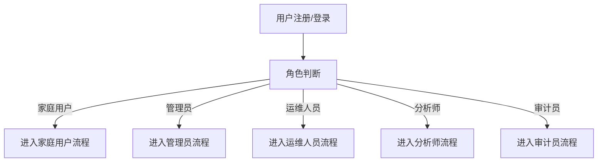
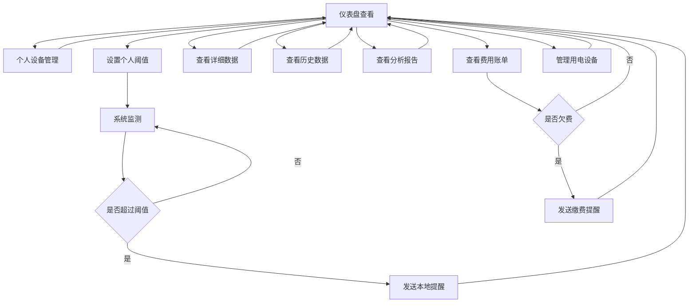
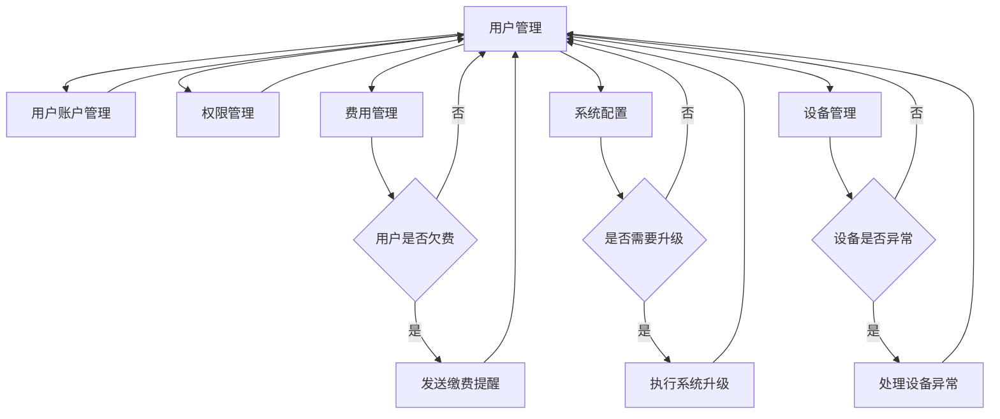
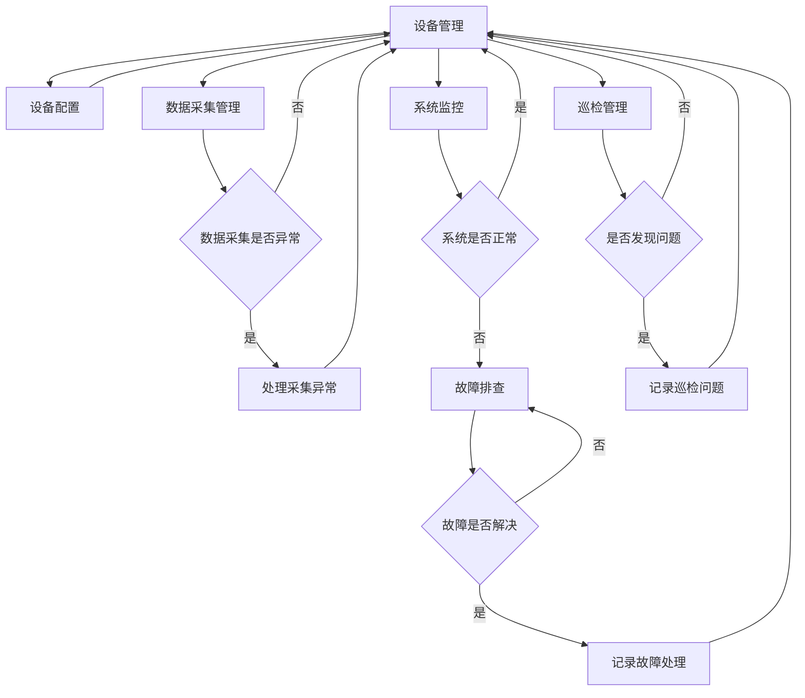
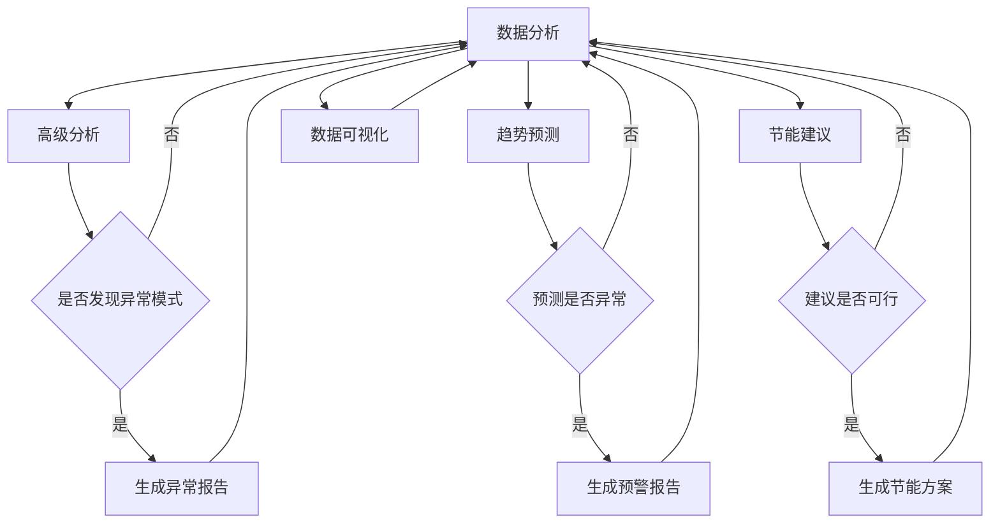
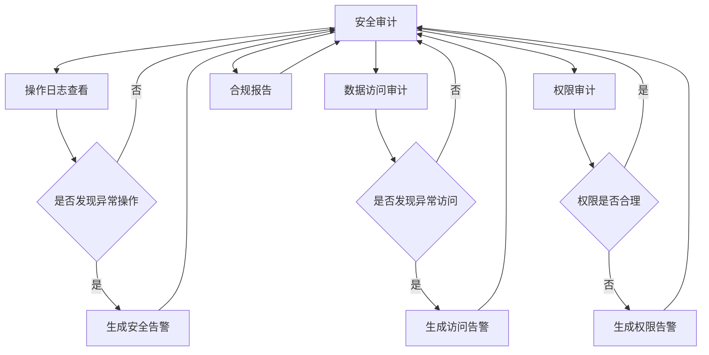

# 能源监测平台功能模块设计（最终版）

## 1. 产品概览
能源监测平台是一个面向家庭用户的智能监测系统，用于实时监测和管理家庭电力、燃气和水资源的使用情况。
- 该平台旨在帮助用户提高能源使用效率，降低能源消耗，实现节能减排的目标。
- 通过实时数据监测、阈值提醒和数据分析，为用户提供直观的能源使用情况和优化建议。
- **本地部署**：完全在用户本地环境运行，无需云服务，零成本实现。

## 2. 核心功能

### 2.1 用户角色
| 角色 | 注册方式 | 角色权限 |
|------|----------|----------|
| 家庭用户 | 本地注册 | 查看监测数据、设置个人阈值、接收提醒、查看个人历史数据、管理个人模拟设备 |
| 管理员 | 系统预设 | 所有家庭用户权限 + 用户管理、系统配置、全局阈值设置、数据备份、操作日志查看 |
| 运维人员 | 管理员创建 | 设备管理、数据采集管理、系统监控、故障排查 |
| 分析师 | 管理员创建 | 所有数据查看权限、数据分析、报表生成、趋势预测 |
| 审计员 | 管理员创建 | 操作日志查看、数据访问审计、安全合规检查 |

#### 2.1.1 各角色详细权限

##### 1. 家庭用户
- 查看个人能源监测数据
- 设置个人能源使用阈值
- 接收个人能源使用提醒
- 查看个人历史能源数据
- 管理个人模拟设备
- 导出个人数据报表
- 查看个人能源使用分析报告
- 接收节能建议
- 查看能源费用账单
- 管理家庭用电设备（如开关控制）

##### 2. 管理员
- **所有家庭用户权限**
- **用户管理**：
  - 创建、编辑、删除用户账户，分配用户权限，重置用户密码
  - 管理用户费用信息，发送缴费提醒
  - 审核用户注册申请
  - 管理用户分组和权限模板
- **系统配置**：
  - 配置系统全局参数，设置数据采集频率
  - 管理系统通知模板
  - 配置第三方服务集成
  - 管理系统备份策略
- **设备管理**：
  - 管理所有模拟设备，配置设备参数和数据生成规则
  - 批量导入/导出设备信息
  - 监控设备在线状态
  - 管理设备固件更新
- **数据管理**：
  - 查看所有用户的监测数据，导出全局数据报表，设置全局能源使用阈值
  - 管理数据存储策略
  - 执行数据清理和归档
  - 管理数据字典和编码规则
- **系统维护**：
  - 系统备份和恢复，查看系统操作日志，系统故障排查
  - 管理系统用户登录审计
  - 监控系统性能指标
  - 管理系统升级和补丁

##### 3. 运维人员
- **设备管理**：
  - 管理和监控所有模拟设备，配置设备参数和数据生成规则
  - 批量导入/导出设备信息
  - 监控设备在线状态
  - 管理设备固件更新
  - 执行设备校准和维护
- **数据采集管理**：
  - 配置数据采集频率，监控数据采集状态，处理数据采集异常
  - 管理数据采集点和采集规则
  - 执行数据采集测试
  - 处理数据采集设备故障
- **系统监控**：
  - 监控系统运行状态，查看系统资源使用情况
  - 监控网络连接状态
  - 监控数据库性能
  - 监控服务运行状态
- **故障排查**：
  - 诊断和解决系统故障，处理设备异常情况
  - 执行故障根因分析
  - 管理故障工单和处理流程
  - 编写故障处理报告
- **巡检管理**：
  - 制定设备巡检计划
  - 执行设备巡检任务
  - 记录巡检结果和发现的问题
  - 跟踪巡检问题的解决情况

##### 4. 分析师
- **数据查看**：
  - 查看所有用户的能源监测数据
  - 查看系统全局数据统计
  - 访问历史数据归档
  - 查看设备运行状态数据
- **数据分析**：
  - 分析能源使用趋势，生成能源使用分析报告
  - 执行多维度数据分析
  - 识别能源使用异常模式
  - 分析设备运行效率
- **报表生成**：
  - 导出各种格式的数据报表，创建自定义报表
  - 生成定期分析报告（日/周/月/年）
  - 设计报表模板和样式
  - 批量导出报表
- **趋势预测**：
  - 基于历史数据预测未来能源使用趋势
  - 预测设备故障风险
  - 预测能源费用趋势
  - 制定能源需求预测模型
- **节能建议**：
  - 根据数据分析结果提供节能建议
  - 制定节能方案和实施计划
  - 评估节能措施的效果
  - 提供能源管理最佳实践
- **数据可视化**：
  - 创建自定义数据仪表盘
  - 设计数据可视化图表
  - 配置实时数据大屏
  - 管理数据可视化模板

##### 5. 审计员
- **操作日志查看**：
  - 查看所有用户的系统操作日志
  - 执行日志搜索和过滤
  - 导出日志数据
  - 监控异常操作行为
- **数据访问审计**：
  - 审计用户对数据的访问记录
  - 跟踪敏感数据访问
  - 分析数据访问模式
  - 检测数据访问异常
- **安全合规检查**：
  - 检查系统安全配置，确保系统合规性
  - 执行安全漏洞扫描
  - 验证数据加密状态
  - 评估系统安全风险
- **权限审计**：
  - 审计用户权限分配情况，确保权限合理
  - 检查权限变更历史
  - 验证权限分离原则执行情况
  - 识别过度权限分配
- **合规报告**：
  - 生成安全审计报告
  - 编写合规性评估报告
  - 制定安全改进建议
  - 跟踪安全问题整改情况
- **系统监控**：
  - 监控系统安全事件
  - 跟踪系统配置变更
  - 审计第三方服务访问
  - 验证系统备份和恢复流程

### 2.2 功能模块
我们的能源监测平台包含以下主要页面：
1. **登录/注册页面**：用户账户管理
2. **仪表盘页面**：实时监测数据总览（根据角色显示全局/个人数据）
3. **详细监测页面**：各能源类型详细数据
4. **历史数据页面**：历史数据查询和分析
5. **设置页面**：阈值设置（家庭用户个人设置）
6. **模拟设备管理页面**：管理和配置模拟设备（个人/全局）
7. **用户管理页面**：用户账户和权限管理（管理员）
8. **系统监控页面**：系统运行状态和资源监控（运维人员）
9. **数据分析页面**：高级数据分析和报表生成（分析师）
10. **审计页面**：操作日志和安全审计（审计员）

### 2.3 页面详情
| 页面名称 | 模块名称 | 功能描述 | 实现方式 | 状态 |
|----------|----------|----------|----------|------|
| 登录/注册页面 | 登录模块 | 用户输入用户名和密码进行登录 | 本地认证，无需外部服务 | ☐ |
| 登录/注册页面 | 注册模块 | 新用户创建账户，设置基本信息 | 本地存储用户信息 | ☐ |
| 仪表盘页面 | 数据总览模块 | 显示所有能源类型的实时使用情况，包括当前值、今日用量、本月用量等 | 本地数据计算和展示 | ☐ |
| 仪表盘页面 | 告警提醒模块 | 显示当前未处理的告警信息，包括超限提醒等 | 本地阈值检测和提醒 | ☐ |
| 详细监测页面 | 电力监测模块 | 显示电力实时使用数据，包括电压、电流、功率等参数 | 模拟数据生成和展示 | ☐ |
| 详细监测页面 | 燃气监测模块 | 显示燃气实时使用数据，包括流量、压力等参数 | 模拟数据生成和展示 | ☐ |
| 详细监测页面 | 水资源监测模块 | 显示水资源实时使用数据，包括流量、水位、水质等参数 | 模拟数据生成和展示 | ☐ |
| 历史数据页面 | 数据查询模块 | 按时间范围查询历史监测数据 | 本地数据库查询 | ☐ |
| 历史数据页面 | 数据分析模块 | 生成能源使用趋势图表，分析能源消耗模式 | 本地数据处理和ECharts可视化 | ☐ |
| 历史数据页面 | 报表导出模块 | 导出历史数据报表为Excel或PDF格式 | 本地文件生成 | ☐ |
| 设置页面 | 阈值设置模块 | 设置各能源类型的使用阈值，超过阈值时触发提醒 | 本地配置存储 | ☐ |
| 设置页面 | 系统配置模块 | 配置系统参数，如数据采集频率、提醒方式等 | 本地配置存储 | ☐ |
| 模拟设备管理页面 | 设备管理模块 | 添加、编辑、删除模拟设备，配置设备参数和数据生成规则 | 本地设备配置存储 | ☐ |
| 模拟设备管理页面 | 数据生成模块 | 根据配置的规则生成模拟传感器数据，模拟真实设备行为 | 本地数据生成算法 | ☐ |
| 用户管理页面 | 用户账户管理模块 | 创建、编辑、删除用户账户，重置用户密码 | 本地用户数据存储 | ☐ |
| 用户管理页面 | 权限管理模块 | 分配用户角色和权限，管理角色权限设置 | 基于RBAC模型的权限管理 | ☐ |
| 用户管理页面 | 费用管理模块 | 管理用户费用信息，发送缴费提醒 | 本地费用数据存储 | ☐ |
| 用户管理页面 | 分组管理模块 | 管理用户分组和权限模板 | 本地分组数据存储 | ☐ |
| 系统管理页面 | 系统配置模块 | 配置系统全局参数，设置数据采集频率 | 本地系统配置存储 | ☐ |
| 系统管理页面 | 数据备份模块 | 执行系统数据备份和恢复操作 | 本地文件系统备份 | ☐ |
| 系统管理页面 | 系统监控模块 | 监控系统运行状态，查看系统资源使用情况 | 本地系统监控 | ☐ |
| 系统管理页面 | 通知管理模块 | 管理系统通知模板和发送记录 | 本地通知数据存储 | ☐ |
| 系统管理页面 | 性能监控模块 | 监控系统性能指标，查看系统健康状态 | 本地性能监控 | ☐ |
| 系统管理页面 | 升级管理模块 | 管理系统升级和补丁 | 本地升级管理 | ☐ |
| 系统监控页面 | 服务状态模块 | 监控系统服务运行状态，查看服务健康状态 | 本地服务监控 | ☐ |
| 系统监控页面 | 资源使用模块 | 监控系统CPU、内存、磁盘使用情况 | 本地资源监控 | ☐ |
| 系统监控页面 | 网络状态模块 | 监控系统网络连接状态 | 本地网络监控 | ☐ |
| 系统监控页面 | 告警通知模块 | 接收系统告警通知，处理系统异常 | 本地告警处理 | ☐ |
| 数据分析页面 | 高级分析模块 | 分析能源使用趋势，生成能源使用分析报告 | 本地数据分析算法 | ☐ |
| 数据分析页面 | 报表生成模块 | 导出各种格式的数据报表，创建自定义报表 | 本地文件生成 | ☐ |
| 数据分析页面 | 趋势预测模块 | 基于历史数据预测未来能源使用趋势 | 本地预测算法 | ☐ |
| 数据分析页面 | 节能建议模块 | 根据数据分析结果提供节能建议 | 本地节能建议生成 | ☐ |
| 数据分析页面 | 数据可视化模块 | 创建自定义数据仪表盘，设计数据可视化图表 | 本地数据可视化 | ☐ |
| 审计页面 | 操作日志模块 | 查看所有用户的系统操作日志 | 本地日志存储 | ☐ |
| 审计页面 | 安全审计模块 | 审计用户对数据的访问记录，检查系统安全配置 | 本地审计功能 | ☐ |
| 审计页面 | 权限审计模块 | 审计用户权限分配情况，确保权限合理 | 本地权限审计 | ☐ |
| 审计页面 | 合规报告模块 | 生成安全审计报告，编写合规性评估报告 | 本地合规报告生成 | ☐ |
| 审计页面 | 安全监控模块 | 监控系统安全事件，跟踪系统配置变更 | 本地安全监控 | ☐ |

## 3. 核心流程

### 3.1 家庭用户操作流程
1. 用户注册并登录系统
2. 系统初始化并开始生成模拟能源使用数据
3. 用户添加和配置个人模拟设备（电力、燃气、水资源）
4. 用户查看仪表盘了解实时能源使用情况
5. 用户设置个人能源使用阈值
6. 当能源使用超过阈值时，系统发送本地提醒
7. 用户查看个人历史数据和分析报表
8. 用户根据数据分析结果调整能源使用习惯

### 3.2 管理员操作流程
1. 管理员登录系统
2. 创建和管理用户账户（家庭用户、运维人员、分析师、审计员）
3. 分配用户角色和权限
4. 配置系统全局参数和数据采集频率
5. 管理所有模拟设备和数据生成规则
6. 执行系统数据备份和恢复操作
7. 监控系统运行状态和处理系统故障

### 3.3 运维人员操作流程
1. 运维人员登录系统
2. 管理和监控所有模拟设备
3. 配置设备参数和数据生成规则
4. 监控数据采集状态和处理数据采集异常
5. 监控系统运行状态和处理系统故障

### 3.4 分析师操作流程
1. 分析师登录系统
2. 查看所有用户的能源监测数据
3. 分析能源使用趋势和生成分析报告
4. 导出各种格式的数据报表
5. 基于历史数据预测未来能源使用趋势
6. 根据数据分析结果提供节能建议

### 3.5 审计员操作流程
1. 审计员登录系统
2. 查看所有用户的系统操作日志
3. 审计用户对数据的访问记录
4. 检查系统安全配置和用户权限分配情况
5. 生成安全审计报告

### 3.1 登录与角色判断流程


### 3.2 家庭用户流程图


### 3.3 管理员流程图


### 3.4 运维人员流程图


### 3.5 分析师流程图


### 3.6 审计员流程图


### 3.7 角色交互关系

#### 3.7.1 管理员与其他角色的交互

##### 管理员 ↔ 家庭用户
- **账户管理**：管理员创建、编辑、删除家庭用户账户
- **权限分配**：管理员为家庭用户分配适当的权限
- **费用管理**：管理员向欠费家庭用户发送缴费提醒
- **设备管理**：管理员为家庭用户配置和管理设备
- **数据查看**：管理员查看家庭用户的能源使用数据

##### 管理员 ↔ 运维人员
- **任务分配**：管理员向运维人员分配设备维护任务
- **故障处理**：运维人员向管理员报告故障处理结果
- **设备审批**：运维人员提交设备配置变更，管理员审批
- **系统监控**：管理员查看运维人员的系统监控报告

##### 管理员 ↔ 分析师
- **分析需求**：管理员向分析师提出特定的分析需求
- **报告查看**：管理员查看分析师生成的分析报告和节能建议
- **数据授权**：管理员授权分析师访问特定的数据范围

##### 管理员 ↔ 审计员
- **审计请求**：管理员请求审计员进行安全审计
- **合规报告**：审计员向管理员提交合规性评估报告
- **安全告警**：审计员向管理员报告发现的安全问题
- **权限审计**：审计员向管理员报告权限分配问题

#### 3.7.2 其他角色之间的交互

##### 家庭用户 ↔ 运维人员
- **问题提交**：家庭用户向运维人员提交设备问题
- **故障处理**：运维人员处理家庭用户的设备故障
- **维护通知**：运维人员向家庭用户发送设备维护通知

##### 家庭用户 ↔ 分析师
- **节能建议**：分析师向家庭用户推送个性化节能建议
- **分析报告**：家庭用户查看分析师生成的个人能源使用分析报告

##### 运维人员 ↔ 分析师
- **数据优化**：运维人员与分析师协作优化数据采集参数
- **设备效率**：分析师向运维人员提供设备运行效率分析
- **故障预测**：分析师向运维人员提供设备故障预测

##### 运维人员 ↔ 审计员
- **操作审计**：审计员审计运维人员的系统操作
- **权限检查**：审计员检查运维人员的权限使用情况

##### 分析师 ↔ 审计员
- **数据访问**：审计员审计分析师的数据访问记录
- **报告审计**：审计员检查分析师报告的合规性

#### 3.7.3 具体交互场景示例

##### 场景1：设备故障处理流程
1. **家庭用户**发现设备异常，提交故障报告
2. **运维人员**接收故障报告，进行故障排查
3. **运维人员**处理故障并记录处理结果
4. **运维人员**通知**家庭用户**故障已解决
5. **运维人员**向**管理员**报告故障处理情况

##### 场景2：节能建议流程
1. **分析师**分析家庭用户的能源使用数据
2. **分析师**生成个性化节能建议
3. **分析师**将节能建议推送给**家庭用户**
4. **家庭用户**查看并实施节能建议
5. **分析师**跟踪节能效果并调整建议

##### 场景3：安全审计流程
1. **管理员**请求**审计员**进行系统安全审计
2. **审计员**执行安全审计，发现权限问题
3. **审计员**向**管理员**提交安全审计报告
4. **管理员**根据审计报告调整用户权限
5. **审计员**验证权限调整是否合规

## 4. 技术架构设计

### 4.1 分层架构
- **感知层**：模拟传感器，负责数据生成
- **网络层**：本地网络连接，实现模块间通信
- **平台层**：本地服务，提供数据存储、分析和处理功能，包括权限管理服务
- **应用层**：用户界面和交互功能，包括Web端，支持多角色访问控制

### 4.2 技术选型
| 类别 | 技术 | 版本 | 选型理由 |
|------|------|------|----------|
| **前端** | React | 18.x | 组件化、生态成熟，适合复杂数据可视化应用 |
| | Vite | 5.x | 现代前端构建工具，开发体验和构建速度优秀 |
| | Recharts | 2.x | React 图表库，适合仪表盘与趋势图展示 |
| **后端** | Java | 17 | 成熟稳定的编程语言，适合企业级应用 |
| | Spring Boot | 3.x | 快速开发框架，简化配置，提高开发效率 |
| **微服务** | Spring Cloud | 2023.x | 提供微服务架构支持，适合分布式系统 |
| | Nacos | 2.3.x | 服务注册与配置中心，支持本地嵌入式数据库 |
| | OpenFeign | 4.0.x | 简化服务间通信，适合微服务架构 |
| | Spring Cloud Gateway | 4.0.x | API网关，统一入口，支持路由和过滤 |
| | Resilience4j | 2.1.x | 服务熔断和限流，保护系统 |
| **数据库** | MySQL | 8.0 | 关系型数据库，适合结构化数据存储 |
| | MongoDB | 6.0+ | 非关系型数据库，适合存储非结构化数据 |
| **缓存** | Redis | 7.0+ | 提高数据读取速度，支持实时数据处理 |
| **消息队列** | RocketMQ | 5.0+ | 高性能消息队列，处理高并发数据 |
| | Kafka | 3.0+ | 处理高并发数据采集，保证数据传输可靠性 |
| **文件存储** | FastDFS | 6.0+ | 分布式文件存储，适合存储图片、文件等 |
| **监控** | ELK Stack | 8.x | 日志管理和分析 |
| | Sentinel | 1.8+ | 服务熔断和限流，保护系统 |
| **CI/CD** | Jenkins | 2.400+ | 持续集成/持续部署 |
| **容器化** | Docker | 20.10+ | 容器化部署，简化环境管理 |
| | Docker Compose | 2.10+ | 多容器管理，简化部署 |
| **权限管理** | Spring Security | 6.x | 提供基于RBAC的权限管理，支持细粒度权限控制 |

## 5. 数据需求

### 5.1 数据采集
- **电力数据**：电压、电流、功率、用电量
- **燃气数据**：流量、压力、用气量
- **水资源数据**：流量、水位、水质（pH值、浊度）
- **采集频率**：默认5秒/次，可配置

### 5.2 数据存储
- **实时数据**：存储最近24小时的详细数据
- **历史数据**：按小时、天、月聚合存储
- **告警数据**：存储所有告警记录，包括告警类型、时间、处理状态
- **用户数据**：存储用户账户信息和个人配置
- **角色数据**：存储角色信息和角色权限配置
- **权限数据**：存储系统权限信息
- **用户角色关系**：存储用户与角色的关联关系
- **设备数据**：存储模拟设备配置信息和数据生成规则
- **操作日志**：存储所有用户的系统操作日志
- **系统配置**：存储系统全局参数和配置信息

### 5.3 数据安全
- **本地存储**：所有数据存储在用户本地，无需网络传输
- **访问控制**：基于RBAC模型的细粒度权限管理，确保用户只能访问授权的资源
- **操作审计**：记录所有用户的系统操作日志，便于安全审计和故障排查
- **数据备份**：提供手动备份功能，将数据导出为文件
- **密码加密**：用户密码使用加密存储，确保账户安全
- **权限分离**：不同角色之间的权限分离，避免权限滥用

## 6. 实现方案

### 6.1 前端实现
- 使用 React 18.x + Vite 构建单页应用
- 使用 React Router 实现页面路由，支持基于角色的路由守卫
- 使用 Zustand / React Query 等进行状态管理和数据请求缓存，包含用户角色和权限信息
- 使用 Recharts 等图表库实现数据可视化（仪表盘、历史趋势、分析图表）
- 响应式设计，支持桌面端和平板端显示
- 实现基于角色的菜单和页面访问控制，根据用户权限动态显示/隐藏导航项与操作按钮

### 6.2 后端实现
- 使用Spring Boot 3.x构建RESTful API
- 使用Spring Security 6.x实现基于RBAC模型的权限管理
- 使用JPA/MyBatis实现数据库操作，包括用户、角色、权限等实体的CRUD操作
- 使用内存缓存提高性能，缓存用户权限信息
- 实现模拟数据生成服务
- 实现操作日志记录和安全审计功能
- 实现基于角色的API访问控制

### 6.3 数据库实现
- 使用MySQL 8.0本地数据库
- 设计合理的表结构，包括：

  #### 核心表结构
  - **用户表（user）**：存储用户账户信息
  - **角色表（role）**：存储角色信息
  - **权限表（permission）**：存储权限信息
  - **用户角色关系表（user_role）**：存储用户与角色的关联关系
  - **角色权限关系表（role_permission）**：存储角色与权限的关联关系
  - **设备表（device）**：存储设备信息
  - **实时数据表（realtime_data）**：存储实时监测数据
  - **历史数据表（history_data）**：存储历史聚合数据
  - **告警表（alert）**：存储告警记录
  - **操作日志表（operation_log）**：存储系统操作日志
  - **系统配置表（system_config）**：存储系统配置信息

  #### 新增表结构（支持新功能）
  - **费用表（fee）**：存储用户费用信息
  - **缴费记录表（payment_record）**：存储用户缴费记录
  - **用户分组表（user_group）**：存储用户分组信息
  - **用户分组关系表（user_group_relation）**：存储用户与分组的关联关系
  - **巡检计划表（inspection_plan）**：存储设备巡检计划
  - **巡检记录表（inspection_record）**：存储设备巡检记录
  - **故障表（fault）**：存储设备故障信息
  - **故障处理记录表（fault_handle_record）**：存储故障处理记录
  - **分析报告表（analysis_report）**：存储数据分析报告
  - **节能建议表（energy_saving_suggestion）**：存储节能建议
  - **通知表（notification）**：存储系统通知信息
  - **消息表（message）**：存储用户消息
  - **数据采集点表（data_collection_point）**：存储数据采集点信息
  - **数据采集规则表（data_collection_rule）**：存储数据采集规则
  - **服务表（service）**：存储微服务信息
  - **服务实例表（service_instance）**：存储微服务实例信息
  - **服务调用记录表（service_invoke_record）**：存储服务调用记录
  - **系统性能表（system_performance）**：存储系统性能指标
  - **备份记录表（backup_record）**：存储系统备份记录
  - **升级记录表（upgrade_record）**：存储系统升级记录

  #### MongoDB存储（非结构化数据）
  - **设备配置集合（device_config）**：存储设备详细配置信息
  - **用户偏好集合（user_preference）**：存储用户个性化偏好设置
  - **分析结果集合（analysis_result）**：存储详细的数据分析结果
  - **日志集合（log）**：存储详细的系统日志

- 实现数据聚合和查询优化，为权限管理、数据查询等相关的查询添加索引
- 设计合理的数据分区策略，提高大数据量下的查询性能
- 实现数据清理策略，定期清理过期数据，避免存储空间过度占用

### 6.4 模拟数据实现
- 基于预设规则生成模拟数据
- 支持配置数据波动范围和模式
- 模拟真实设备的使用 patterns（如用电高峰、用水高峰等）
- 支持手动触发数据变化，模拟设备开关操作

## 7. 部署方案

### 7.1 部署环境
- **硬件要求**：Linux虚拟机（建议8GB+内存，50GB+磁盘空间）
- **操作系统**：Ubuntu 22.04 LTS或CentOS 7+
- **容器技术**：Docker 20.10+，Docker Compose 2.10+

### 7.2 部署架构

```
┌─────────────────────────────────────────────────────────────────┐
│                      Linux 虚拟机                             │
├─────────────────────────────────────────────────────────────────┤
│ ┌─────────────┐  ┌─────────────┐  ┌─────────────┐  ┌──────────┐ │
│ │  Docker     │  │  Docker     │  │  Docker     │  │  Docker  │ │
│ │  Compose    │  │  Compose    │  │  Compose    │  │  Compose │ │
│ └─────┬───────┘  └─────┬───────┘  └─────┬───────┘  └────┬─────┘ │
│       │                │                │                │       │
│ ┌─────▼───────┐  ┌─────▼───────┐  ┌─────▼───────┐  ┌────▼─────┐ │
│ │  核心服务   │  │  数据服务   │  │  消息服务   │  │  监控服务 │ │
│ │  - Gateway  │  │  - MySQL    │  │  - RocketMQ │  │  - ELK    │ │
│ │  - Auth     │  │  - MongoDB  │  │  - Kafka    │  │  - Jenkins│ │
│ │  - User     │  │  - Redis    │  │             │  │  - Sentinel│ │
│ │  - Device   │  │  - FastDFS  │  │             │  │           │ │
│ │             │  │             │  │             │  │           │ │
│ └─────────────┘  └─────────────┘  └─────────────┘  └──────────┘ │
└─────────────────────────────────────────────────────────────────┘
```

### 7.3 部署步骤

#### 7.3.1 环境准备
1. **安装Docker和Docker Compose**：
   ```bash
   # 安装Docker
   sudo apt update
   sudo apt install docker.io
   
   # 安装Docker Compose
   sudo apt install docker-compose
   
   # 启动Docker服务
   sudo systemctl start docker
   sudo systemctl enable docker
   ```

2. **创建Docker网络**：
   ```bash
   docker network create energy-monitor-network
   ```

#### 7.3.2 服务部署
1. **编写Docker Compose配置文件**：
   ```yaml
   version: '3.8'
   
   services:
     # 核心服务
     gateway:
       image: energy-monitor/gateway:latest
       ports:
         - "8080:8080"
       networks:
         - energy-monitor-network
       depends_on:
         - nacos
     
     auth:
       image: energy-monitor/auth:latest
       networks:
         - energy-monitor-network
       depends_on:
         - nacos
         - redis
     
     # 数据服务
     mysql:
       image: mysql:8.0
       environment:
         MYSQL_ROOT_PASSWORD: root
         MYSQL_DATABASE: energy_monitor
       volumes:
         - mysql-data:/var/lib/mysql
       networks:
         - energy-monitor-network
     
     mongodb:
       image: mongo:6.0
       volumes:
         - mongo-data:/data/db
       networks:
         - energy-monitor-network
     
     redis:
       image: redis:7.0
       networks:
         - energy-monitor-network
     
     # 消息服务
     rocketmq:
       image: rocketmqinc/rocketmq:5.0
       ports:
         - "9876:9876"
         - "10911:10911"
       volumes:
         - rocketmq-data:/home/rocketmq/logs
       networks:
         - energy-monitor-network
     
     # 监控服务
     elasticsearch:
       image: elasticsearch:8.0
       environment:
         - discovery.type=single-node
         - ES_JAVA_OPTS=-Xms1g -Xmx1g
       volumes:
         - es-data:/usr/share/elasticsearch/data
       networks:
         - energy-monitor-network
     
     kibana:
       image: kibana:8.0
       ports:
         - "5601:5601"
       networks:
         - energy-monitor-network
       depends_on:
         - elasticsearch
     
     logstash:
       image: logstash:8.0
       networks:
         - energy-monitor-network
       depends_on:
         - elasticsearch
     
     # 服务注册与配置中心
     nacos:
       image: nacos/nacos-server:2.3.0
       environment:
         - MODE=standalone
       ports:
         - "8848:8848"
       networks:
         - energy-monitor-network
   
   volumes:
     mysql-data:
     mongo-data:
     redis-data:
     rocketmq-data:
     es-data:
   
   networks:
     energy-monitor-network:
       external: true
   ```

2. **启动服务**：
   ```bash
   docker-compose up -d
   ```

3. **验证服务**：
   ```bash
   # 查看服务状态
   docker-compose ps
   
   # 查看服务日志
   docker-compose logs -f
   ```

#### 7.3.3 应用部署
1. **编译后端服务**：
   ```bash
   # 克隆代码库
   git clone <repository-url>
   cd energy-monitor
   
   # 编译服务
   mvn clean package -DskipTests
   
   # 构建Docker镜像
   docker build -t energy-monitor/gateway:latest gateway/
   docker build -t energy-monitor/auth:latest auth/
   # 构建其他服务镜像...
   ```

2. **构建前端应用**：
   ```bash
   # 安装依赖
   cd frontend
   npm install
   
   # 构建应用
   npm run build
   
   # 部署到Nginx
   docker run -d -p 80:80 \
     -v $(pwd)/dist:/usr/share/nginx/html \
     --name frontend nginx:alpine
   ```

### 7.4 服务管理

#### 7.4.1 服务监控
- **ELK Stack**：访问 `http://<虚拟机IP>:5601` 查看日志
- **Nacos**：访问 `http://<虚拟机IP>:8848/nacos` 管理服务
- **Jenkins**：访问 `http://<虚拟机IP>:8080/jenkins` 进行CI/CD

#### 7.4.2 服务维护
- **数据备份**：定期备份MySQL、MongoDB数据
- **服务更新**：通过Jenkins自动化部署
- **服务扩容**：根据需要增加容器实例

### 7.5 部署优势

1. **环境一致性**：Docker确保开发、测试、生产环境一致
2. **快速部署**：Docker Compose一键启动所有服务
3. **资源隔离**：各服务运行在独立容器中，互不影响
4. **易于扩展**：基于Docker Compose或Kubernetes实现水平扩展
5. **版本管理**：通过Docker镜像版本控制服务版本
6. **简化维护**：统一的服务管理和监控

### 7.6 注意事项

1. **资源配置**：根据虚拟机性能调整Docker容器的资源限制
2. **网络配置**：确保Docker网络配置正确，服务间可以正常通信
3. **数据持久化**：使用Docker卷确保数据持久化
4. **安全配置**：设置合适的密码和访问控制
5. **备份策略**：定期备份重要数据
6. **监控告警**：配置适当的监控和告警机制

## 8. 功能亮点

### 8.1 开源技术栈
- **完全使用开源免费技术**：所有技术组件均为开源软件，无版权费用
- **本地部署方案**：无需云服务，降低基础设施成本
- **容器化部署**：使用Docker容器技术，提高资源利用率
- **模拟数据方案**：无需硬件设备，通过软件模拟实现完整功能

### 8.2 功能丰富
- 完整的能源监测功能
- 详细的数据可视化
- 智能阈值提醒
- 历史数据分析
- 报表导出功能
- 基于RBAC模型的权限管理
- 多角色支持（家庭用户、管理员、运维人员、分析师、审计员）
- 细粒度权限控制
- 操作日志审计

### 8.3 易于实现
- 模块化微服务架构，便于开发和维护
- 详细的技术选型和实现方案
- 模拟数据方案，无需硬件依赖
- Docker容器化部署，简化环境管理
- 支持单节点Nacos运行，资源占用低
- 完整的部署文档和脚本，便于快速部署

### 8.4 可扩展性
- 模块化设计，易于添加新功能
- 支持后续接入真实硬件设备
- 支持数据导出，便于与其他系统集成
- 基于微服务架构，可根据需求灵活扩展

## 9. 技术挑战与解决方案

### 9.1 挑战一：模拟数据的真实性
- **挑战**：生成的模拟数据需要接近真实使用情况
- **解决方案**：
  - 基于真实家庭能源使用模式设计数据生成算法
  - 支持配置不同的使用场景（如工作日、周末、节假日）
  - 模拟设备开关和使用习惯对能源消耗的影响

### 9.2 挑战二：本地部署的性能优化
- **挑战**：本地PC性能有限，需要确保系统流畅运行
- **解决方案**：
  - 优化数据库查询，使用索引和缓存
  - 降低数据采集频率，默认5秒/次，可根据设备性能调整
  - 使用轻量级组件，避免资源密集型技术

### 9.3 挑战三：数据存储的可靠性
- **挑战**：本地存储可能面临数据丢失风险
- **解决方案**：
  - 提供定期手动备份功能
  - 实现数据导出为CSV/Excel文件
  - 设计合理的数据清理策略，避免数据量过大

### 9.4 挑战四：用户界面的美观性
- **挑战**：需要提供专业、美观的用户界面
- **解决方案**：
  - 使用现代前端框架和UI库
  - 参考市场上成熟产品的设计
  - 实现响应式布局，确保在不同设备上的良好体验

### 9.5 挑战五：权限管理的复杂性
- **挑战**：实现基于RBAC模型的细粒度权限管理，确保权限分配合理
- **解决方案**：
  - 设计清晰的角色权限体系，基于实际业务需求
  - 使用Spring Security实现权限管理，简化开发
  - 提供直观的权限配置界面，方便管理员操作
  - 实现权限继承机制，减少权限配置的复杂性

### 9.6 挑战六：多角色用户体验
- **挑战**：不同角色的用户需要不同的界面和功能，确保用户体验一致
- **解决方案**：
  - 基于角色动态显示/隐藏UI元素，确保用户只看到授权的功能
  - 实现角色专属仪表盘，展示与角色相关的核心信息
  - 设计统一的界面风格，确保不同角色的用户体验一致
  - 提供角色切换功能（如果需要），方便用户在不同角色间切换

### 9.7 挑战七：微服务架构的复杂性
- **挑战**：本地部署微服务架构，确保服务间通信和依赖管理正确
- **解决方案**：
  - 使用Nacos作为服务注册与配置中心，简化服务发现
  - 采用轻量级组件（如Resilience4j）减少资源占用
  - 实现服务健康检查和容错机制
  - 提供详细的服务启动顺序和依赖关系文档

### 9.8 挑战八：Nacos本地运行优化
- **挑战**：确保Nacos在本地环境稳定运行，资源占用合理
- **解决方案**：
  - 使用standalone模式运行Nacos，减少资源消耗
  - 配置合理的JVM参数，根据本地PC性能调整内存分配
  - 定期清理Nacos日志和临时文件，避免磁盘空间占用过大
  - 实现Nacos服务的自动重启机制，提高可靠性

### 9.9 挑战九：Docker容器化部署优化
- **挑战**：确保Docker容器在Linux虚拟机上稳定运行，资源分配合理
- **解决方案**：
  - 为每个容器配置合理的资源限制（CPU、内存）
  - 使用Docker卷进行数据持久化，避免数据丢失
  - 配置Docker网络，确保容器间通信顺畅
  - 实现容器的健康检查和自动重启机制

### 9.10 挑战十：微服务架构复杂性管理
- **挑战**：管理多个微服务的依赖关系和通信，确保系统稳定
- **解决方案**：
  - 使用Nacos作为服务注册与配置中心，简化服务发现
  - 实现服务间的熔断和限流机制，保护系统
  - 建立完善的服务监控和日志系统，便于问题排查
  - 制定服务启动顺序和依赖关系文档，确保部署正确

### 9.11 挑战十一：多组件集成协调
- **挑战**：协调ELK、MongoDB、RocketMQ等多个组件的配置和运行
- **解决方案**：
  - 使用Docker Compose统一管理所有组件
  - 为每个组件配置合适的参数和资源限制
  - 建立组件间的依赖关系，确保启动顺序正确
  - 实现组件的健康检查和监控机制

## 10. 总结

本设计方案针对本地部署需求，提供了一套功能丰富、零成本、可实现的能源监测平台解决方案。通过使用开源免费技术，结合模拟数据方案，用户可以在没有硬件设备的情况下，完整体验能源监测平台的所有功能。

系统包含完整的功能模块，包括实时监测、数据分析、阈值提醒、报表导出等，同时支持本地部署和零成本实现。这套方案特别适合作为毕业设计项目，既展示了完整的系统设计和实现能力，又避免了硬件成本和云服务费用的支出。

未来，系统可以通过扩展接入真实的硬件设备，实现从模拟到实际的无缝过渡，为用户提供更加真实和实用的能源监测服务。